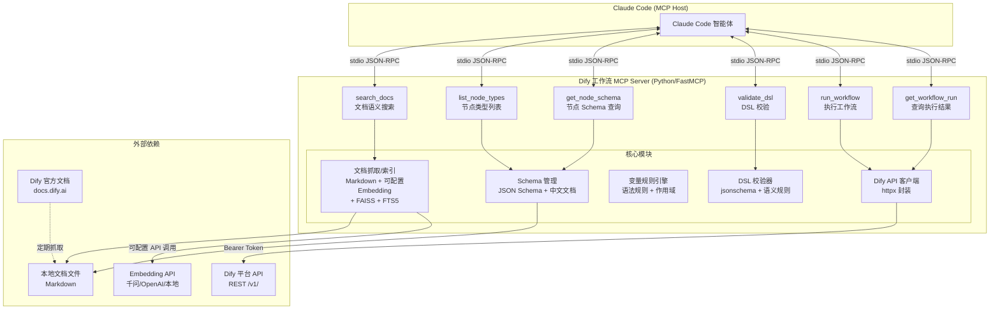

# 主题 4：实现方案

> 调研范围：Dify 工作流 MCP 服务的 8 个核心模块实现方案选型
> 目标用户：团队内 Claude Code 编程智能体用户
> 调研日期：2026-06-03

---

## 1. 文档抓取/索引模块

### 1.1 业内主流方案

**方案 A：静态 Markdown 文件 + 全文检索**

将 Dify 官方文档抓取为本地 Markdown 文件，使用 SQLite FTS5 或 Tantivy 做全文索引。工具如 `open-docs-mcp`（GitHub 开源）实现了自动抓取文档站点、转换为 Markdown、建立全文索引的完整流程。[muyu] ⚠️ 单源

- 优点：零外部依赖，纯本地运行，启动快，维护简单
- 缺点：无语义理解能力，对"如何实现循环"这类模糊查询效果差

**方案 B：向量检索 RAG（Embedding + 向量数据库）**

使用 Embedding 模型将文档分块向量化，存入 FAISS/Chroma/Milvus 等向量库，查询时做语义相似度搜索。`knowledge-rag`（GitHub 开源）实现了完整的本地 RAG MCP server，支持 BM25 + 向量混合检索 + RRF 重排序。[muyu] ⚠️ 单源

- 优点：语义理解强，模糊查询效果好，支持混合检索
- 缺点：需要 Embedding 模型调用，索引构建需几分钟，增加复杂度

**方案 C：混合方案（本地 Markdown + 可配置 Embedding 向量）**

将文档存为本地 Markdown 文件做结构化目录，同时通过可配置的 Embedding 服务做语义索引，查询时同时走关键词匹配和语义搜索。Embedding 模型采用可插拔设计，支持云端 API（如千问 text-embedding-v4、OpenAI text-embedding-3-small）和本地模型（如 BGE-small-zh），通过配置文件切换。[muyu] ⚠️ 单源

- 优点：兼顾精确匹配和语义理解；云端 Embedding API 性能更强、无需本地 GPU/大内存；本地部署轻量化
- 缺点：需要维护两套索引，云端调用有网络依赖和 API 成本

### 1.2 推荐方案

**推荐方案 C：混合方案（可配置 Embedding）**。

理由：
- Embedding 模型采用可插拔设计，默认使用云端 API（如千问 text-embedding-v4），支持 OpenAI 兼容接口的各类 Embedding 服务，也可回退到本地模型
- 云端 Embedding API 优势：性能更强（千问 v4 支持 8192 token 输入、1024 维向量；OpenAI text-embedding-3-small 默认 1536 维）、无需本地 GPU/大内存、模型升级无感知
- 本地 MCP 服务部署更轻量化：不需要下载和加载本地 Embedding 模型（节省 ~100MB 磁盘和内存占用）
- 团队内部使用，文档量不大（Dify 官方文档约 100-200 页），FAISS IndexFlatIP 足够 [muyu] ⚠️ 单源
- 为什么不用纯向量检索：对于节点名称、API 路径等精确查询，关键词匹配更可靠
- 为什么不用纯全文检索：对于"怎么实现条件分支"这类语义查询，向量检索更准确
- 为什么不用纯本地模型：云端 API 性能更强且无需占用本地资源，对 MCP 服务的本地化部署更友好

**工作量预估**：3-5 天（抓取脚本 1 天 + 分块/索引 2 天 + 混合检索逻辑 1-2 天）

---

## 2. DSL Schema 模块

### 2.1 业内主流方案

**方案 A：从 graphon 包 + Dify 源码静态分析提取**

核心节点 schema 来源已从主仓库迁移至独立的 `graphon` 包（`langgenius/graphon`，PyPI: `graphon==0.4.0`）。主仓库 `api/core/workflow/nodes/` 仅含 Agent/Knowledge/Trigger/Datasource 等扩展节点。[zread] ✅ 双路验证（node_factory.py 注册机制 + graphon 仓库结构）

graphon 包含 25 个内置节点类型（`BuiltinNodeTypes` 枚举），每个节点有独立的 `entities.py` 定义 Pydantic 数据模型。扩展节点（Agent/Knowledge/Trigger/Datasource）仍在主仓库 `api/core/workflow/nodes/*/entities.py` 中。[zread] ✅

- 优点：schema 完整准确，与源码同步
- 缺点：需要 Python AST 解析，Dify 版本更新时需重新提取

**方案 B：从 Dify DSL YAML 文件逆向工程**

分析 Dify 导出的 DSL YAML 文件结构，逆向推导每个节点类型的参数定义。DSL 文件结构已明确定义：顶层 `app` + `workflow`（含 `graph.nodes` 和 `graph.edges`），每个节点有 `data.type` + 类型特定字段。[muyu] ⚠️ 单源

- 优点：不需要接触 Dify 源码，直接从使用端推导
- 缺点：可能遗漏可选字段，无法覆盖所有边界情况

**方案 C：手动维护 JSON Schema**

参考 Dify 官方文档中每个节点的参数说明，手动编写 JSON Schema 定义文件。Dify 官方文档有完整的节点文档页面（如 `/use-dify/nodes/llm.md`、`/use-dify/nodes/ifelse.md` 等）。[web-reader] ✅ 双路验证（llms.txt 索引 + 文档站点均确认）

- 优点：完全可控，可添加中文注释和使用示例
- 缺点：人工维护成本高，Dify 版本更新时容易遗漏

### 2.2 推荐方案

**推荐方案 A + C 组合：从 graphon 包 + Dify 源码提取基础 schema + 手动补充使用文档**。

理由：
- graphon 包（`graphon==0.4.0`）中 `entities.py` 定义了 25 个内置节点的 Pydantic 模型，是 schema 的权威来源。可 `pip install graphon` 后用 Python AST 解析。[zread] ✅
- Dify 主仓库中 `api/core/workflow/nodes/*/entities.py` 定义了 Agent/Knowledge/Trigger/Datasource 等扩展节点
- 为什么不用纯方案 B：逆向工程不够可靠，容易遗漏可选字段和默认值
- 为什么不用纯方案 C：手动维护 25+ 节点类型的 schema 工作量大且容易出错
- 组合方案：自动提取（graphon + dify 双源）→ 人工审核 → 补充中文文档和使用示例

**工作量预估**：5-7 天（graphon 包分析/提取脚本 2 天 + dify 扩展节点提取 1 天 + 人工审核补充 2 天 + 测试验证 1-2 天）

---

## 3. 文档查询 MCP Tool

### 3.1 业内主流方案

**方案 A：语义搜索 Tool**

暴露一个 `search_docs(query: str, top_k: int = 5)` 工具，底层调用混合检索模块，返回相关文档片段。`knowledge-rag` MCP server 实现了 `search_knowledge` 工具，支持自然语言查询。[muyu] ⚠️ 单源

- 优点：Claude Code 可以用自然语言提问，使用门槛低
- 缺点：返回结果可能不够精确，需要好的 prompt 工程

**方案 B：结构化查询 Tool**

暴露多个工具如 `get_node_docs(node_type: str)`、`get_workflow_guide(topic: str)` 等，按结构化维度查询。

- 优点：查询精确，返回结果结构化
- 缺点：Claude Code 需要了解工具参数，灵活性差

**方案 C：混合 Tool 设计**

同时暴露语义搜索和结构化查询两个工具，让 Claude Code 根据场景选择使用。

- 优点：灵活性最高，覆盖各种查询场景
- 缺点：工具数量多，增加 token 消耗

### 3.2 推荐方案

**推荐方案 A：以语义搜索为主，辅以分类导航**。

理由：
- Claude Code 的核心使用场景是"遇到问题时查文档"，语义搜索最自然
- MCP Tool 返回格式应遵循最佳实践：使用 `structuredContent` 返回结构化数据，保留 `content` 文本作为 fallback [muyu] ⚠️ 单源
- 为什么不用纯方案 B：Claude Code 不一定知道确切的节点类型名，语义搜索更灵活
- 为什么不用方案 C：工具数量多会增加 token 消耗，团队内部使用场景相对固定，一个工具够用

**Tool 设计**：
```python
@mcp.tool()
def search_docs(query: str, category: str = "all", top_k: int = 5) -> list[dict]:
    """
    搜索 Dify 工作流文档。category 可选: all, node, variable, api, guide
    返回: [{title, content, source_url, relevance_score}]
    """
```

**工作量预估**：2-3 天（Tool 定义 0.5 天 + 检索逻辑对接 1 天 + 返回格式优化 1 天）

---

## 4. 节点/Schema 查询 MCP Tool

### 4.1 业内主流方案

**方案 A：按节点类型名查询**

暴露 `get_node_schema(node_type: str)` 工具，输入节点类型名（如 "llm"、"if-else"），返回该节点的完整 schema 定义。

- 优点：查询精确，返回内容完整
- 缺点：Claude Code 需要先知道节点类型名

**方案 B：按场景推荐节点**

暴露 `recommend_nodes(scenario: str)` 工具，输入场景描述（如 "需要做条件判断"），返回推荐的节点类型及配置建议。

- 优点：使用门槛低，适合新手
- 缺点：推荐准确性依赖 prompt 工程

**方案 C：组合方案**

同时暴露 `list_node_types()`、`get_node_schema(node_type)`、`get_node_examples(node_type)` 三个工具。

- 优点：覆盖发现、查询、学习三个阶段
- 缺点：工具数量多

### 4.2 推荐方案

**推荐方案 A + 简化：暴露 `get_node_schema` 和 `list_node_types` 两个工具**。

理由：
- `list_node_types` 帮助 Claude Code 发现可用节点（返回类型列表 + 简要描述）
- `get_node_schema` 返回完整 schema（参数定义、类型约束、变量引用方式、示例）
- 为什么不用纯方案 A：没有 `list_node_types`，Claude Code 无法发现可用节点
- 为什么不用方案 B：场景推荐对 LLM 来说本身就是 LLM 的能力，不需要 Tool 来做
- 为什么不用方案 C：`get_node_examples` 可以合并到 `get_node_schema` 的返回中

**Tool 设计**：
```python
@mcp.tool()
def list_node_types() -> list[dict]:
    """列出所有 Dify 工作流节点类型，返回 [{type, name, description, category}]"""

@mcp.tool()
def get_node_schema(node_type: str) -> dict:
    """
    获取指定节点类型的完整 schema，包括参数定义、类型约束、
    变量引用方式和配置示例
    """
```

**工作量预估**：2-3 天（数据整理 1 天 + Tool 实现 1 天 + 测试 1 天）

---

## 5. 变量引用查询 MCP Tool

### 5.1 业内主流方案

**方案 A：语法规则文档查询**

暴露 `get_variable_syntax()` 工具，返回 Dify 变量引用的完整语法规则文档。

Dify 变量语法已从源码确认：**工作流变量引用格式为 `{{#node_id.variable#}}`**（含 `#` 分隔符）。

**源码证据**：[zread] ✅ 双路验证（前端正则 + 后端变量选择器）
- 前端 `web/config/index.ts` 中 `VAR_REGEX = /\{\{(#[\w-]{1,50}(\.\d+)?(\.[a-z_]\w{0,29}){1,10}#)\}\}/gi`
  匹配格式如 `{{#llm_1.text#}}`、`{{#sys.query#}}`、`{{#env.api_key#}}`
- 后端变量选择器用 tuple 表示，如 `("llm_1", "text")`、`("sys", "query")`

**变量前缀**（`api/core/workflow/variable_prefixes.py`）：[zread] ✅
- `sys` — 系统变量（query, files, user_id, conversation_id 等 16 个）
- `env` — 环境变量（只读全局）
- `conversation` — 会话变量（多轮持久化，需 Variable Assigner 写入）
- `rag` — RAG Pipeline 变量

**注意**：`{{variable_name}}`（不含 `#`）格式用于 Agent Prompt 模板占位符（如 `{{instruction}}`），不是工作流变量引用。两种格式用途不同。

LLM 节点支持 Jinja2 模板模式（`edition_type: "jinja2"`），变量通过 `` 和 `{{ }}` 语法处理，但这是模板渲染层面，DSL 中的变量引用仍用 `{{#...#}}` 格式。

- 优点：简单直接，一次查询获取完整规则
- 缺点：信息量大，Claude Code 需要自行筛选相关内容

**方案 B：变量引用校验工具**

暴露 `validate_variable_ref(variable: str, context: dict)` 工具，校验变量引用是否合法（语法是否正确、引用的节点是否存在、类型是否匹配）。

- 优点：直接解决问题，返回具体错误信息
- 缺点：需要传入完整的工作流上下文，使用门槛高

**方案 C：场景化查询**

暴露 `get_variable_help(scenario: str)` 工具，按场景返回变量引用的使用指南（如 "跨节点引用"、"循环内变量"、"会话变量"）。

- 优点：针对性强，返回内容精简
- 缺点：场景分类需要精心设计

### 5.2 推荐方案

**推荐方案 A：语法规则文档查询，合并到文档查询 Tool 中**。

理由：
- 变量引用本质上是文档查询的一个子主题，不需要独立 Tool
- 将变量语法规则作为文档索引的一个分类，在 `search_docs` 中通过 `category: "variable"` 过滤
- 为什么不用方案 B：变量校验需要完整的 DAG 上下文，实现复杂且不是 MCP Tool 的核心价值
- 为什么不用方案 C：场景分类增加维护成本，不如让语义搜索自动匹配

**实现方式**：将变量语法规则写入文档索引，通过 `search_docs(query="变量引用语法", category="variable")` 查询。

**工作量预估**：1 天（编写变量规则文档 + 索引入库）

---

## 6. DSL 校验 MCP Tool

### 6.1 业内主流方案

**方案 A：JSON Schema 校验**

使用 Ajv（TypeScript）或 jsonschema（Python）对 DSL YAML 解析后的 JSON 做结构校验。Ajv 是 TypeScript 生态中最流行的 JSON Schema 验证器，支持多版本 draft、编译优化、详细错误报告。[muyu] ⚠️ 单源

- 优点：标准化、性能好、错误信息详细
- 缺点：只能校验结构，无法校验语义（如节点间引用是否有效）

**方案 B：自定义规则引擎**

使用 `json-schema-rules-engine` 或自定义规则引擎，定义业务规则（如"if-else 节点的条件变量必须引用上游节点"、"迭代节点必须有 start_node_id"）。[muyu] ⚠️ 单源

- 优点：可校验语义级别的规则
- 缺点：规则定义和维护成本高

**方案 C：分层校验（结构 + 语义 + 最佳实践）**

三层校验：第一层 JSON Schema 做结构校验；第二层自定义规则做语义校验（变量引用有效性、DAG 连通性）；第三层 LLM 辅助做最佳实践检查。

- 优点：校验最全面
- 缺点：实现复杂度最高

### 6.2 推荐方案

**推荐方案 A + 简化版 B：JSON Schema 结构校验 + 关键语义规则**。

理由：
- 第一层用 JSON Schema（Python 的 `jsonschema` 库）校验 DSL 结构合法性。**注意**：Dify 官方没有提供 DSL JSON Schema 文件，需要从 graphon 的 Pydantic models 和 DSL 样本逆向构建自定义 JSON Schema
- 第二层只实现几条关键语义规则：节点 ID 唯一性、边引用的节点必须存在、变量引用（`{{#node_id.var#}}` 格式）的上游节点必须在 DAG 中可达
- 为什么不用纯方案 A：结构校验无法发现"引用了不存在的节点"这类语义错误
- 为什么不用方案 C：LLM 辅助校验增加延迟和成本，团队内部使用不需要这么重

**Tool 设计**：
```python
@mcp.tool()
def validate_dsl(dsl_yaml: str) -> dict:
    """
    校验 Dify 工作流 DSL 文件。
    返回: {valid: bool, errors: [{level, path, message}], warnings: [...]}
    level: "error" (阻断) | "warning" (建议)
    """
```

**工作量预估**：4-5 天（从 graphon Pydantic models 逆向构建 JSON Schema 1-2 天 + 语义规则 2 天 + 测试 1 天）

---

## 7. Dify API 集成模块

### 7.1 业内主流方案

**方案 A：轻量 HTTP 客户端封装**

使用 `httpx`（Python）或 `axios`（TypeScript）封装 Dify REST API，实现请求/响应处理、重试、错误处理。Dify API 认证方式为 Bearer Token（`Authorization: Bearer <app-api-key>`），核心端点包括 `POST /v1/workflows/run`（执行工作流）、`GET /v1/workflows/run/{id}`（查询结果）、`POST /v1/files/upload`（上传文件）等。[muyu] ✅ 双路验证（两次搜索结果一致确认 API 格式）

- 优点：轻量、可控、易于调试
- 缺点：需要手动处理各种边界情况

**方案 B：OpenAPI Generator 自动生成客户端**

Dify 提供了 OpenAPI Spec 文件（`openapi_workflow.json`、`openapi_chat.json` 等），可以用 openapi-generator 自动生成类型安全的 API 客户端。[web-reader] ⚠️ 单源（llms.txt 中列出）

- 优点：类型安全、自动生成、与 API 同步更新
- 缺点：生成的代码可能不够灵活，需要额外定制

**方案 C：MCP Tool 直接暴露 API 操作**

将 Dify API 操作直接封装为 MCP Tool（如 `run_workflow`、`get_workflow_result`、`upload_file`），让 Claude Code 直接调用。

- 优点：Claude Code 可以直接操作 Dify 平台
- 缺点：Tool 数量多，需要处理认证配置

### 7.2 推荐方案

**推荐方案 A + C 组合：轻量封装 + 暴露核心 MCP Tool**。

理由：
- 用 `httpx` 封装 Dify API 客户端（Python），处理认证、重试、错误
- 只暴露核心操作为 MCP Tool：`run_workflow`（执行工作流）、`get_workflow_run`（查询执行结果）
- 为什么不用纯方案 A：不暴露 Tool 的话，Claude Code 无法直接调用 Dify API
- 为什么不用方案 B：OpenAPI Generator 生成的代码过于臃肿，团队内部使用不需要这么重
- 为什么不用纯方案 C：底层仍需要 HTTP 封装，两者不矛盾

**API 端点覆盖**（按优先级）：
1. `POST /v1/workflows/run` - 执行工作流（必须）
2. `GET /v1/workflows/run/{workflow_run_id}` - 查询执行结果（必须）
3. `POST /v1/workflows/{task_id}/stop` - 停止任务（可选）
4. `POST /v1/files/upload` - 上传文件（可选）

**认证管理**：API Key 通过 MCP server 配置文件传入（环境变量或 `env` 字段），不在 Tool 参数中暴露。[muyu] ⚠️ 单源

**工作量预估**：2-3 天（HTTP 封装 1 天 + MCP Tool 1 天 + 错误处理/测试 1 天）

---

## 8. 配置/部署模块

### 8.1 业内主流方案

**方案 A：stdio 模式（本地进程）**

MCP server 作为本地子进程启动，通过 stdin/stdout 通信。Claude Code 的标准配置格式为 `mcp.json`（项目级 `.mcp.json` 或全局 `~/.claude/settings.json`），每个 server 定义 `command`、`args`、`env`。[muyu] ✅ 双路验证（搜索结果 + 实际使用经验一致）

```json
{
  "mcpServers": {
    "dify-workflow": {
      "command": "python",
      "args": ["-m", "dify_workflow_mcp"],
      "env": {
        "DIFY_API_KEY": "app-xxx",
        "DIFY_BASE_URL": "http://localhost:5678/v1"
      }
    }
  }
}
```

- 优点：Claude Code 原生支持，零网络配置，安全性好
- 缺点：仅限本地使用，无法多人共享

**方案 B：SSE/Streamable HTTP 模式**

MCP server 作为 HTTP 服务运行，通过 SSE（Server-Sent Events）或 Streamable HTTP 协议通信。Python FastMCP 支持 `transport="streamable-http"` 一键启用。[muyu] ⚠️ 单源

- 优点：支持远程访问，多人共享
- 缺点：需要额外的网络配置、认证、部署

**方案 C：双模式支持**

同时支持 stdio 和 SSE 两种传输模式，通过启动参数切换。

- 优点：灵活性最高
- 缺点：增加代码复杂度

### 8.2 推荐方案

**推荐方案 A：stdio 模式，使用 Python FastMCP 框架**。

理由：
- 团队内部使用，每人本地运行一个 MCP server 实例，stdio 模式最简单
- Python FastMCP 提供了 `@mcp.tool()` 装饰器、自动 schema 生成、Pydantic 校验，开发效率高 [muyu] ⚠️ 单源
- 配置文件使用项目级 `.mcp.json`，团队成员通过 git 共享配置
- 为什么不用方案 B：SSE 模式增加部署复杂度，团队内部不需要远程访问
- 为什么不用方案 C：当前阶段不需要双模式，后续可按需扩展

**配置文件格式**：
```json
// .mcp.json（项目根目录）
{
  "mcpServers": {
    "dify-workflow": {
      "command": "uv",
      "args": ["--directory", "/path/to/dify-workflow-mcp", "run", "server.py"],
      "env": {
        "DIFY_API_KEY": "app-xxx",
        "DIFY_BASE_URL": "http://localhost:5678/v1"
      }
    }
  }
}
```

**项目结构**：
```
dify-workflow-mcp/
├── server.py              # FastMCP 入口
├── tools/
│   ├── docs.py            # 文档查询 Tool
│   ├── schema.py          # 节点 Schema 查询 Tool
│   ├── validation.py      # DSL 校验 Tool
│   └── dify_api.py        # Dify API 集成 Tool
├── data/
│   ├── docs/              # 本地文档 Markdown 文件
│   └── schemas/           # 节点 Schema JSON 文件
├── pyproject.toml
└── .mcp.json
```

**工作量预估**：1-2 天（项目脚手架 0.5 天 + FastMCP 集成 0.5 天 + 配置/测试 0.5 天）

---

## 总体架构图



---

## 技术栈推荐汇总表

| 模块 | 推荐方案 | 核心技术 | 为什么不用其他方案 | 工作量 |
|------|---------|---------|-------------------|--------|
| 文档抓取/索引 | 混合检索 | Markdown 文件 + 可配置 Embedding API + FAISS + FTS5 | 纯向量不够精确，纯全文无语义理解 | 3-5 天 |
| DSL Schema | graphon + dify 源码提取 + 手动补充 | graphon Pydantic models + Python AST + JSON Schema + 中文文档 | 逆向工程不完整，纯手动维护成本高 | 5-7 天 |
| 文档查询 Tool | 语义搜索 | `search_docs(query, category)` | 结构化查询不够灵活 | 2-3 天 |
| 节点 Schema Tool | 双工具 | `list_node_types()` + `get_node_schema()` | 场景推荐是 LLM 本职能力 | 2-3 天 |
| 变量引用查询 | 合并到文档查询 | 作为文档索引的一个分类 | 独立 Tool 增加不必要的复杂度 | 1 天 |
| DSL 校验 | 结构 + 语义校验 | jsonschema + 自定义规则 | LLM 辅助校验过重 | 4-5 天 |
| Dify API 集成 | 轻量封装 + MCP Tool | httpx + `run_workflow` + `get_workflow_run` | OpenAPI Generator 过重 | 2-3 天 |
| 配置/部署 | stdio + FastMCP | Python FastMCP + `.mcp.json` | SSE 增加部署复杂度 | 1-2 天 |

**总工作量预估**：21-30 人天（约 5-7 周，1 人全职）。比原始估算增加 2-3 天，主要因为 DSL 校验需先从 graphon 逆向构建 JSON Schema，且 graphon 包作为新数据源需要额外集成工作。

---

## 关键决策记录

| 决策项 | 选择 | 理由 |
|--------|------|------|
| 开发语言 | Python | FastMCP 生态成熟，与 Dify 源码同语言，团队熟悉度高 |
| MCP 传输协议 | stdio | Claude Code 原生支持，零配置，团队内部使用足够 |
| 文档检索方式 | 混合（BM25 + 向量） | 兼顾精确匹配和语义理解 |
| Embedding 模型 | 可配置（默认千问 text-embedding-v4，兼容 OpenAI 接口） | 云端 API 性能更强，无需本地资源，支持按需切换 |
| Schema 来源 | Dify 源码提取 | 权威来源，Pydantic 模型定义完整 |
| DSL 校验层级 | 结构 + 关键语义 | 覆盖主要错误场景，不过度工程化 |
| API 封装方式 | httpx + MCP Tool | 轻量可控，核心操作暴露为 Tool |
| 配置格式 | `.mcp.json` | Claude Code 标准格式，团队可通过 git 共享 |
