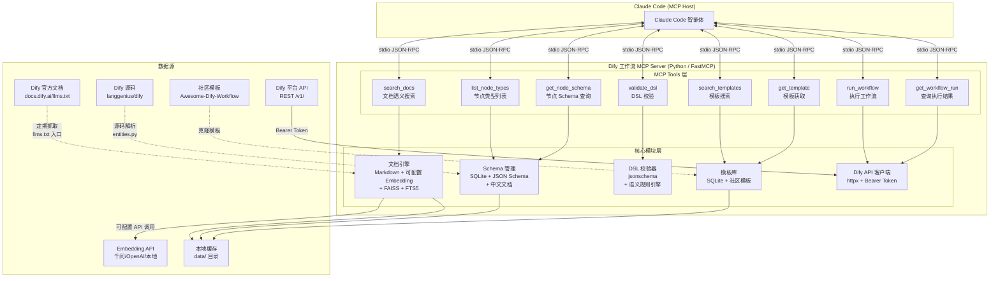

# 05 - 决策汇总（v4）

> 基于 4 份调研文档 + 5 角色对抗评估 + 三次验证（Mintlify MCP、graphon 包、开源 Skill 项目）
> v1：2026-06-03 | v2：对抗评估 | v3：Mintlify MCP 验证 | v4：开源 Skill 项目验证
> v4 更新：发现 yzmw123/dify-workflow-dsl-skill 已覆盖 80%+ 需求，Phase 1 工作量从 1-2 天缩减至 0.5-0.75 天。
> 项目架构详见 `07-项目架构.md`。

---

## 1. 产品形态决策

### 1.1 核心定位

面向 Claude Code 编程智能体的 Dify 工作流开发辅助工具，解决「AI 开发 Dify 工作流时缺乏官方文档参考、节点配置规范和语法校验」的问题。

**市场空白确认**：在「AI 辅助工作流开发」MCP 赛道，n8n 是唯一有成熟实现的平台。Dify/Coze/FastGPT 均无类似产品。[01-产品形态]

### 1.2 产品能力分层（v4）

**Phase 1（Mintlify MCP + Skill，0.5-0.75 天）：**

| 能力 | 实现方式 | 来源 |
|------|---------|------|
| 文档查询 | Mintlify MCP（`search_dify_docs` + `query_docs_filesystem_dify_docs`） | Mintlify 托管，免费 |
| 节点 Schema | Skill（`.claude/skills/dify-workflow/references/node-schemas.md`） | yzmw123 适配 |
| 变量引用语法 | Skill（`.claude/skills/dify-workflow/references/variable-syntax.md`） | yzmw123 + 源码补充 |
| DSL 校验 | Skill（`scripts/validate_dsl.py`） | yzmw123（15+ 规则） |
| 工作流模板 | Skill（`.claude/skills/dify-workflow/references/templates/`） | yzmw123 + R3flector |
| 节点输出字段 | Skill（`.claude/skills/dify-workflow/references/node-output-fields.md`） | r-hashi01 移植 |

**Phase 2（自建 MCP Server，按需 10-15 天，8 个 Tools）：**

| # | Tool | 输入 | 输出 | 替代 Phase 1 的什么 |
|---|------|------|------|-------------------|
| 1 | `search_docs` | `query, category, top_k` | `[{title, content, source_url}]` | 替代 Mintlify MCP（离线可用） |
| 2 | `list_node_types` | 无 | `[{type, name, description}]` | 替代 Skill Schema 表格 |
| 3 | `get_node_schema` | `node_type` | `{params, variable_refs, examples}` | 替代 Skill Schema 表格 |
| 4 | `validate_dsl` | `dsl_yaml` | `{valid, errors, warnings}` | 替代 Skill checklist |
| 5 | `search_templates` | `query, node_types` | `[{name, description, dsl_preview}]` | 替代 Skill 模板 |
| 6 | `get_template` | `template_name` | `{dsl_yaml}` | 替代 Skill 模板 |
| 7 | `run_workflow` | `inputs, response_mode` | `{workflow_run_id, status}` | 新增（Skill 无法实现） |
| 8 | `get_workflow_run` | `workflow_run_id` | `{status, outputs}` | 新增（Skill 无法实现） |

**设计依据**：
- Phase 1 用 Mintlify MCP + Skill 验证需求，零 MCP 开发成本 [v3 验证]
- Phase 2 的 8 个 Tools 是 Phase 1 能力的结构化升级（离线 + 精确 + API 集成）[04]
- 工具数量 8 个，符合 MCP 最佳实践的 5-15 个范围 [01]

### 1.3 返回格式规范

| 工具类型 | 格式 | 理由 |
|---------|------|------|
| 文档查询 | Markdown 文本 | AI 直接理解，无需解析 |
| 节点 Schema | 结构化 JSON | 需要精确的类型信息 |
| 校验结果 | 结构化 JSON（valid/errors/warnings） | AI 需要程序化处理错误 |
| 模板 | 结构化 JSON + DSL YAML | 直接可用的工作流定义 |

错误信息设计原则：返回人类可读、可操作的文本，不抛异常。如 `"Node 'llm_1' references undefined variable '{{code_2.output}}'. Did you mean '{{code_1.output}}'?"` [01]

---

## 2. 关键资源决策

### 2.1 文档获取方式

| 资源 | 获取方式 | 路径 | 优先级 |
|------|---------|------|--------|
| 节点文档（20 页） | HTTP 抓取 | `docs.dify.ai/llms.txt` → 逐页抓取 | P0 |
| 概念文档 | HTTP 抓取 | `docs.dify.ai/en/use-dify/build/*` | P1 |
| OpenAPI 规范 | 直接下载 | `docs.dify.ai/zh/api-reference/openapi_workflow.json` | P1 |
| 社区 DSL 模板 | GitHub 克隆 | `svcvit/Awesome-Dify-Workflow`（10.5k stars） | P2 |

**关键发现**：Dify 文档不在 Git 仓库中（`docs/` 目录仅有 README），需通过 HTTP 抓取。但官方提供 `llms.txt` 索引，可作为抓取入口。[02]

**为什么不维护文档 fork**：直接抓取官方文档并缓存，文档更新时重新抓取即可，避免维护分叉成本。[02]

**官方归档的 docs-mcp-server 教训**：`langgenius/dify-docs-mcp-server` 于 2025-10-30 归档（仅存活 5 个月，4 commits，8 stars）。归档原因：(1) Mintlify 推出了原生 MCP Server 自动生成，使自定义 wrapper 多余；(2) Dify v1.6.0 内置双向 MCP 支持，团队重心转移。该 server 仅是 Mintlify trievelte API 的薄代理（~200 行代码），无本地索引/Embedding。我们的方案（Mintlify MCP 免费覆盖文档查询 + yzmw123 Skill 覆盖 Schema/校验）比其更完整。[web-reader + web-search-prime] ✅ 双路验证

### 2.2 源码提取方案

| 资源 | 提取方式 | 源码路径 | 难度 |
|------|---------|---------|------|
| 节点类型枚举 | 解析 BuiltinNodeTypes 枚举 | `graphon` 包 `src/graphon/enums.py` | 低 |
| 内置节点 Schema（25 个） | 解析 Pydantic model | `graphon` 包 `src/graphon/nodes/*/entities.py` | 中 |
| 扩展节点 Schema | 解析 Pydantic model | `langgenius/dify` `api/core/workflow/nodes/*/entities.py`（Agent/Knowledge/Trigger/Datasource） | 中 |
| 变量引用语法 | 解析前端正则 + 后端变量选择器 | 前端 `web/config/index.ts`（VAR_REGEX）+ 后端 `system_variables.py` | 低 |
| 变量前缀定义 | 解析常量文件 | `api/core/workflow/variable_prefixes.py`（sys/env/conversation/rag） | 低 |
| DSL 格式规范 | 逆向工程 | `api/services/app_dsl_service.py` + DSL YAML 样本 | 中 |
| 节点 UI 文案 | 解析 i18n 文件 | `web/i18n/en-US/workflow.ts` | 低 |

**推荐方案**：组合使用 graphon 包 Pydantic model 解析 + dify 扩展节点 entities.py 解析 + DSL 样本逆向 + 官方文档抓取，四路互补。[02]

**关键发现（已验证）**：Dify 核心节点类型已迁移至独立的 `graphon` 包（`langgenius/graphon`，PyPI: `graphon==0.4.0`），而非"插件系统"。graphon 是 Python 图执行引擎，包含 25 个内置节点的完整 Pydantic schema。Dify 主仓库通过 `node_factory.py` 从 graphon 注册内置节点。[zread] ✅ 双路验证

### 2.3 API 集成范围

| API | 是否公开 | 可用性 |
|-----|---------|--------|
| 执行工作流 `/v1/workflows/run` | ✅ 公开 | 文档完善，支持 blocking/streaming |
| 查询执行结果 `/v1/workflows/run/{id}` | ✅ 公开 | 文档完善 |
| DSL 导入/导出 | ❌ 仅控制台内部 API | 无法通过 Service API 调用 |
| 节点类型列表 | ❌ 不存在 | 需从源码提取 |
| DSL 校验 | ❌ 不存在 | 校验逻辑嵌入导入流程 |

**认证方式**：Bearer Token，每个应用独立 API Key，通过 MCP server 配置文件传入。[02]

---

## 3. 开源复用决策

### 3.1 推荐组合（v4）

**Phase 1 复用（Mintlify MCP + Skill 适配）：**

| 层次 | 推荐方案 | 来源项目 | 集成方式 | 理由 |
|------|---------|---------|---------|------|
| 文档查询 | Mintlify 原生 MCP | Mintlify 托管（docs.dify.ai） | `.mcp.json` 配置 | 免费、自动更新、语义搜索+虚拟文件系统 |
| Skill 基座 | yzmw123 Skill 适配 | `yzmw123/dify-workflow-dsl-skill`（DSL 0.6.0） | git clone + 适配 | 覆盖 80%+：25+ Schema、校验脚本、4 模板、172+ DSL 分析 |
| 节点输出字段 | 移植参考 | `r-hashi01/skills-to-dify-workflow` | 移植到 Skill | 独特价值：从 Dify 源码验证的输出字段名 |
| 补充模板 | 移植参考 | `R3flector/skills`（dify-workflow-builder） | 移植到 Skill | 8 个工作流模式，补充 yzmw123 的 4 个 |

**Phase 2 复用（自建 MCP Server，按需）：**

| 层次 | 推荐方案 | 来源项目 | 集成方式 | 理由 |
|------|---------|---------|---------|------|
| MCP Server 框架 | Python FastMCP | `PrefectHQ/fastmcp`（15k stars, Apache-2.0） | pip 依赖 | 生态最成熟，装饰器式 API |
| 节点 Schema 存储 | SQLite + FTS5 模式 | `czlonkowski/n8n-mcp`（MIT） | 架构借鉴 | 与我们需求最相似，模式可复用 |
| DSL 校验逻辑 | yzmw123 validate_dsl.py 增强 | `yzmw123/dify-workflow-dsl-skill` | 脚本增强 | Phase 1 已有 15+ 规则，Phase 2 增加 jsonschema |
| Dify API 调用 | httpx 封装 | `zhuzhoulin/dify-mcp-server` | 模式参考 | 最流行的 Dify MCP 项目 |
| DSL 模板库 | 社区模板导入 | `svcvit/Awesome-Dify-Workflow`（10.5k stars） | 克隆数据 | Phase 2 的模板库数据源 |

### 3.2 各项目的复用方式

| 项目 | 复用方式 | 说明 |
|------|---------|------|
| yzmw123/dify-workflow-dsl-skill | **适配为 Phase 1 Skill 基座** | 不 fork，直接适配其 SKILL.md + references/ + scripts/。DSL 版本 0.6.0 与当前 Dify 一致 |
| r-hashi01/skills-to-dify-workflow | 移植节点输出字段参考 | 不 fork，提取其 `references/dify-node-types.md` 中的输出字段数据 |
| R3flector/skills | 移植 2-4 个工作流模板 | 不 fork，选取其 8 个模式中的补充模板 |
| czlonkowski/n8n-mcp | 架构借鉴（Phase 2） | 不 fork，参考其 SQLite + FTS5 模式 |
| zhuzhoulin/dify-mcp-server | 模式参考（Phase 2） | 不 fork，参考其 Dify API 调用模式 |
| PrefectHQ/fastmcp | pip 依赖（Phase 2） | 直接使用，不 fork |

### 3.3 关键结论

**yzmw123/dify-workflow-dsl-skill 是 Phase 1 的核心基座**——它已覆盖 25+ 节点 Schema、变量语法规则、Python 校验脚本（15+ 规则）、4 个完整模板、172+ 真实 DSL 分析。我们的增量工作仅是补充 rag 前缀、节点输出字段、额外模板和 Mintlify MCP 指引。[v4 验证]

---

## 4. 技术栈决策

### 4.1 8 模块方案选型

| 模块 | 选型 | 核心技术 | 为什么不用替代方案 | 工作量 |
|------|------|---------|-------------------|--------|
| 文档抓取/索引 | 混合检索 | 本地 Markdown + 可配置 Embedding API + FAISS + FTS5 | 纯向量不够精确（API 路径等精确查询），纯全文无语义理解 | 3-5 天 |
| DSL Schema | 源码提取 + 手动补充 | Python AST 解析 entities.py + JSON Schema + 中文文档 | 逆向工程不完整，纯手动维护成本高 | 5-7 天 |
| 文档查询 Tool | 语义搜索 | `search_docs(query, category)` | 结构化查询不够灵活，Claude Code 不一定知道确切节点名 | 2-3 天 |
| 节点 Schema Tool | 双工具 | `list_node_types()` + `get_node_schema()` | 场景推荐是 LLM 本职能力，不需要 Tool | 2-3 天 |
| 变量引用查询 | 合并到文档查询 | 作为文档索引的一个分类 | 独立 Tool 增加不必要的复杂度 | 1 天 |
| DSL 校验 | 结构 + 语义校验 | jsonschema（需从 graphon Pydantic models 逆向构建）+ 自定义规则（节点 ID 唯一性、边引用有效性、变量可达性） | LLM 辅助校验增加延迟和成本，团队内部不需要 | 4-5 天 |
| Dify API 集成 | 轻量封装 + MCP Tool | httpx + `run_workflow` + `get_workflow_run` | OpenAPI Generator 生成代码过于臃肿 | 2-3 天 |
| 配置/部署 | stdio + FastMCP | Python FastMCP + `.mcp.json` | SSE 模式增加部署复杂度，团队内部不需要远程访问 | 1-2 天 |

### 4.2 关键技术决策

| 决策项 | 选择 | 理由 |
|--------|------|------|
| 开发语言 | Python | FastMCP 生态成熟，graphon 包为 Python（可直接解析 Pydantic model），与 Dify 源码同语言，团队熟悉度高 |
| MCP 框架 | FastMCP（Python） | 15k stars，装饰器式 API，自动 schema 生成，Pydantic 校验 |
| MCP 传输协议 | stdio | Claude Code 原生支持，零配置，安全性好 |
| 文档检索 | 混合（FTS5 + 向量） | 兼顾精确匹配和语义理解 |
| Embedding 模型 | 可配置（默认千问 text-embedding-v4，兼容 OpenAI 接口） | 云端 API 性能更强，无需本地资源，支持按需切换 |
| 数据存储 | SQLite + FTS5 | n8n-mcp 验证过的模式，零外部依赖 |
| Schema 来源 | graphon 包 + Dify 源码 entities.py | graphon 包含 25 个内置节点 Pydantic schema，Dify 主仓库含扩展节点 |
| DSL 校验 | jsonschema + 关键语义规则 | 覆盖主要错误场景，不过度工程化 |
| 配置格式 | `.mcp.json` | Claude Code 标准格式，团队可通过 git 共享 |

### 4.3 为什么选 Python 而非 TypeScript

**注**：03-开源项目.md 初版推荐 TypeScript（因 n8n-mcp 为 TypeScript），经验证后修正为 Python。修正理由如下：

| 维度 | Python | TypeScript |
|------|--------|-----------|
| MCP 框架 | FastMCP（15k stars, Apache-2.0）| 官方 SDK（12.5k stars, MIT）|
| graphon 包 | Python 包，`pip install graphon` 即可用，可直接解析 Pydantic model | 需要跨语言解析 |
| Dify 源码 | 同语言，扩展节点 entities.py 可直接参考 | 需要跨语言解析 |
| 文档检索 | FAISS + sentence-transformers 生态成熟 | 需要找 JS 替代品 |
| 团队熟悉度 | 与 Dify 开发经验一致 | 需要学习成本 |
| n8n-mcp 参考 | 仅架构参考，SQLite + FTS5 模式用 Python sqlite3 标准库实现 | 可直接 fork（但不推荐，见 03） |

**结论**：Python 在 graphon 包适配性、Dify 生态适配性和 Embedding 工具链上有明显优势。n8n-mcp 虽为 TypeScript，但我们仅参考其架构模式（SQLite + FTS5），不 fork 代码，故语言不同不构成障碍。

---

## 5. 架构总图



---

## 6. 成本估算

### 6.1 开发工作量（v4：Mintlify MCP + yzmw123 Skill 适配）

**注**：v1 估算 22-30 天（全功能 MCP）。v2 对抗评估修正为渐进路径。v3 Mintlify MCP 验证收窄 Skill 范围。v4 发现 yzmw123/dify-workflow-dsl-skill 已覆盖 80%+ 需求，Phase 1 工作量进一步缩减。

| 阶段 | 内容 | 工作量 | 累计 | 状态 |
|------|------|--------|------|------|
| Phase 0a：验证 Mintlify MCP | 确认端点可用、测试文档查询质量 | 0.5 天 | 0.5 天 | ✅ 已完成 |
| Phase 0b：验证开源 Skill 项目 | 分析 yzmw123/r-hashi01/R3flector 三个项目 | 0.5 天 | 1 天 | ✅ 已完成 |
| Phase 1：Skill 适配 | 基于 yzmw123 适配：补充 rag 前缀（0.5h）+ 移植节点输出字段（1h）+ 补充模板（1-2h）+ Mintlify MCP 指引（0.5h）+ 集成测试（1-2h）。**文档查询由 Mintlify MCP 覆盖，Schema/校验/模板 80%+ 来自 yzmw123** | 0.5-0.75 天 | 1.5-1.75 天 | 待启动 |
| Phase 1 验证期 | 团队内部试用（Mintlify MCP + Skill），收集反馈 | 0 天（自然使用） | 1.5-1.75 天 | — |
| Phase 2：折中 MCP Server（按需） | FastMCP 框架 + SQLite FTS5 + 本地 JSON Schema + 8 个 MCP Tools | 10-15 天 | 11.5-16.75 天 | 按需 |
| Phase 3：升级向量检索（按需） | +Embedding + FAISS 向量索引 + graphon 运行时依赖 | 3-5 天 | 14.5-21.75 天 | 按需 |

**最可能路径**：Phase 0（已完成）+ Phase 1 = 0.5-0.75 天即可交付可用产品。

**对比各版本**：
- v1（全功能 MCP）：22-30 天
- v2（渐进路径）：1.5-2.5 天
- v3（Mintlify MCP + Skill）：1-2 天
- **v4（Mintlify MCP + yzmw123 适配）：0.5-0.75 天**

**为什么 v4 如此轻量**：yzmw123 项目已经做了大量工作——25+ 节点 Schema、变量语法规则、Python 校验脚本、4 个完整模板、172+ 真实 DSL 分析。我们的增量工作仅是：补充 rag 前缀、移植节点输出字段、补充模板、写 Mintlify MCP 使用指引。

### Phase 1 → Phase 2 的判断标准

如果团队在试用 Mintlify MCP + Skill 期间遇到以下情况，启动 Phase 2：
1. Mintlify MCP 文档查询不够精准或延迟太高（需本地 FTS5 替代）
2. Skill 中的 Schema 信息不够精确（需结构化 JSON 替代 Markdown）
3. 需要程序化 DSL 校验（Skill 的 checklist 不够精确）
4. 需要直接从 Claude Code 执行 Dify 工作流
5. 团队中有人用 Cursor/Windsurf，需要 MCP 协议支持
5. Skill 内容占用过多 context window

### 6.2 运行成本

| 项目 | 成本 | 说明 |
|------|------|------|
| Embedding API | 按调用量计费（千问 text-embedding-v4 约 0.7 元/百万 token） | 首次索引约 100-200 页文档，后续增量更新成本极低 |
| SQLite 存储 | <10MB | 文档 + Schema + 模板 |
| Dify API 调用 | 按 Dify 平台定价 | 仅 Management Tools 需要 |
| 本地依赖 | 轻量 | 无本地模型占用，仅 Python 运行时 + SQLite |

---

## 7. 风险与对策

| # | 风险 | 严重度 | 对策 |
|---|------|--------|------|
| 1 | ~~**Dify 节点类型迁移至插件系统**~~ **已修正**：核心节点迁移至 `graphon` 包（`langgenius/graphon`，PyPI 可安装），非插件系统。`api/core/workflow/nodes/` 仅含扩展节点 | ~~高~~ **低** | graphon 包可通过 `pip install graphon` 安装，25 个内置节点的 Pydantic schema 完整可提取。扩展节点从 dify 主仓库提取。双源互补，路径明确 |
| 2 | **Dify DSL 规范无官方文档**，官方承认「DSL 本质上是前端画布的 JSON 结构」 | 高 | 从 `app_dsl_service.py` 逆向 + 社区 DSL 样本分析 + graphon Pydantic models 推导 + 官方文档抓取，四路互补 |
| 3 | **Dify 快速迭代导致文档/schema 过期** | 中 | 实现增量更新机制，文档抓取脚本定期运行（建议每周），schema 提取脚本绑定 Dify 版本 |
| 4 | **无直接 fork 对象**，需从架构借鉴到自研 | 中 | 参考 n8n-mcp 的 SQLite + FTS5 模式，降低架构风险；先做 Spike 验证数据层可行性 |
| 5 | **变量引用语法**：工作流变量用 `{{#node_id.variable#}}`（含 `#`），Agent Prompt 占位符用 `{{variable_name}}`（不含 `#`），两者用途不同易混淆 | 低 | 将变量规则作为文档索引的一部分，在文档中明确区分两种格式 |
| 6 | **Dify API 无 DSL 导入/导出端点**，Management Tools 覆盖范围有限 | 低 | MVP 聚焦 Core Tools（文档+Schema+校验），API 集成作为增强功能 |
| 7 | ~~**200 页文档的 RAG 需求未验证**~~ **已验证**：Mintlify 原生 MCP 可用且功能强大（语义搜索 + 虚拟文件系统），文档查询零开发成本 | ~~中~~ **低** | Mintlify MCP 已确认可用：端点 `https://dify-6c0370d8.main-kill-isr.mintlify.me/mcp`，零认证，提供 `search_dify_docs`（语义搜索）和 `query_docs_filesystem_dify_docs`（虚拟文件系统，支持 rg/cat/tree）两个工具。21 个节点文档页面完整可读 |
| 8 | **官方已放弃类似方向**（v2 新增） | 中 | `langgenius/dify-docs-mcp-server` 5 个月归档（4 commits, 8 stars）。归档原因：Mintlify 原生 MCP 替代 + Dify v1.6.0 内置 MCP。我们的方案（Mintlify MCP + Skill）比官方薄代理更健壮 |

---

## 8. 推荐执行路径（v4：Mintlify MCP + yzmw123 Skill 适配）

**注**：v1 推荐"MCP Server 全功能开发"。v2 对抗评估修正为"渐进路径"。v3 Mintlify MCP 验证收窄 Skill 范围。v4 开源 Skill 项目验证发现 yzmw123 已覆盖 80%+ 需求，Phase 1 缩减为适配工作。

### 验证总结

| 验证项 | 结果 | 影响 |
|--------|------|------|
| Mintlify MCP | ✅ 可用，2 个工具，21 节点页面 | 文档查询零开发成本 |
| graphon 包 | ✅ 25 内置节点 Pydantic schema | Schema 数据源确认 |
| yzmw123 Skill | ✅ 覆盖 80%+ 需求（25+ Schema、校验脚本、4 模板） | Phase 1 从 1-2 天缩减至 0.5-0.75 天 |
| r-hashi01 Skill | ✅ 节点输出字段参考（独特价值） | 补充 yzmw123 缺失的输出字段 |
| R3flector Skill | ✅ 8 个工作流模式 | 补充模板 |

### Phase 0：Mintlify MCP 验证 ✅ 已完成

**验证结果**：Mintlify 已为 docs.dify.ai 提供原生 MCP Server，功能远超预期。

| 项目 | 结果 |
|------|------|
| 端点 | `https://dify-6c0370d8.main-kill-isr.mintlify.me/mcp` |
| 认证 | 零认证（公开文档） |
| 传输协议 | Streamable HTTP |
| 速率限制 | 5,000 请求/小时/用户，1,000/小时/站点 |
| 工具 1 | `search_dify_docs` — 语义搜索，支持 `query`/`version`/`language` 参数 |
| 工具 2 | `query_docs_filesystem_dify_docs` — 虚拟文件系统，支持 `rg`/`cat`/`tree`/`head` 等 shell 命令直接读取文档页面 |
| 文档覆盖 | Dify v1.9.x ~ v1.10.x，21 个节点文档页面 + tutorials + build 指南 + API 文档 |
| 文档质量 | 极好。LLM 节点文档覆盖模型选择、Prompt 配置、Context RAG、结构化输出、Memory、Vision、Jinja2、错误处理等全部高级特性 |

**配置方式**（已写入项目 `.mcp.json`）：
```json
{
  "dify-docs": {
    "type": "streamable-http",
    "url": "https://dify-6c0370d8.main-kill-isr.mintlify.me/mcp"
  }
}
```

### Phase 1：Skill 适配（0.5-0.75 天）

**三层架构**（详见 `07-项目架构.md`）：

| 层 | 内容 | 来源 | 状态 |
|----|------|------|------|
| Layer 1：文档搜索 | Mintlify MCP（语义搜索 + 虚拟文件系统） | Mintlify 托管 | ✅ 已配置 |
| Layer 2：结构化知识 | Skill（Schema + 语法规则 + 校验 + 模板） | yzmw123 为主 + r-hashi01/R3flector 补充 | 待适配 |
| Layer 3：运行时执行 | MCP Server（8 Tools） | 自建 | Phase 2 按需 |

**Phase 1 Skill 适配的具体工作：**

| 任务 | 来源 | 工作量 |
|------|------|--------|
| 适配 yzmw123 的 SKILL.md + references/ | yzmw123/dify-workflow-dsl-skill | 基座，直接适配 |
| 补充 rag 变量前缀文档 | 源码 `variable_prefixes.py` | 0.5h |
| 移植节点输出字段参考 | r-hashi01/skills-to-dify-workflow | 1h |
| 补充 2-4 个工作流模板 | R3flector/skills 的 8 个模式 | 1-2h |
| 新增 Mintlify MCP 使用指引 | 新增 | 0.5h |
| 集成测试（生成 3-5 个实际工作流） | 实测 | 1-2h |

**Phase 1 交付标准**：
- `.mcp.json` 中已配置 Mintlify MCP（文档查询零开发）
- `.claude/skills/dify-workflow.md` 包含：节点 Schema（25+5）、变量语法规则、DSL 校验 checklist、5-8 个工作流模板
- 用户输入 `/dify-workflow` 即可加载 Skill 内容
- Claude Code 通过 Mintlify MCP 查询文档 + Skill 中的 Schema/规则，可生成完整的 Dify DSL YAML

### Phase 2：折中 MCP Server（按需，10-15 天）

**触发条件**（见 6.1 节 Phase 1→Phase 2 判断标准）：
- Skill 不够用（文档查询精度、Schema 结构化程度、DSL 校验精确度）
- 团队中有人用 Cursor/Windsurf，需要 MCP 协议支持
- 需要直接从 Claude Code 执行 Dify 工作流

**Phase 2 交付标准**：
- `search_docs` — FTS5 全文搜索（替代 Mintlify MCP，离线可用 + 更精确）
- `list_node_types` + `get_node_schema` — 结构化 JSON（替代 Skill 中的 Markdown）
- `validate_dsl` — jsonschema + 语义规则（替代 Skill 中的 checklist）
- `search_templates` + `get_template` — 模板库
- `run_workflow` + `get_workflow_run` — Dify API 集成

---

## 9. 勘误记录（2026-06-03 二审修正）

以下问题在初版调研中存在，经源码验证后修正：

| # | 原始结论 | 修正后结论 | 修正依据 |
|---|---------|-----------|---------|
| 1 | 核心节点迁移至"插件系统"，schema 提取路径不明 | 核心节点迁移至 `graphon` 包（`langgenius/graphon`，PyPI: `graphon==0.4.0`），25 个内置节点的 Pydantic schema 完整可提取 | [zread] ✅ 验证 node_factory.py 注册机制 + graphon 仓库结构 |
| 2 | 变量引用格式：旧版 `{{#node_id.output#}}` 已废弃，基础格式为 `{{variable_name}}` | 工作流变量引用格式为 `{{#node_id.variable#}}`（含 `#`），是当前活跃格式。`{{variable_name}}`（不含 `#`）仅用于 Agent Prompt 占位符 | [zread] ✅ 验证前端 VAR_REGEX 正则 + 后端变量选择器 |
| 3 | 03 推荐 TypeScript，04/05 推荐 Python | 统一为 Python。graphon 包为 Python，FastMCP 生态更成熟 | 跨文档矛盾修正 |
| 4 | n8n-mcp 同时标"直接 fork 改"和"不直接 fork" | 统一为"架构参考，Python 自研"。不 fork 任何项目 | 跨文档矛盾修正 |
| 5 | 工作量 19-27 人天 | 修正为 22-30 人天（增加 graphon 集成 + JSON Schema 逆向构建工作量） | 估算修正 |
| 6 | DSL 校验可直接用 jsonschema | 需先从 graphon Pydantic models 逆向构建 JSON Schema（官方无现成 Schema 文件） | 前提条件修正 |
| 7 | "市场空白"为既定事实 | "市场空白"基于单次搜索未找到同类产品，仅为初步判断，需持续验证 | 来源可信度修正 |
| 8 | 推荐路径：Spike → MCP Server Phase 1/2/3（22-30 天） | 修正为 B→A 渐进路径：Skill MVP（1-2 天）→ 验证 → 按需做折中 MCP Server（10-15 天） | 对抗评估（06-架构基线决策.md）：红队有力质疑 200 页文档不值得建 RAG；集成评估师评分 B→A 路径 8.0 分 |
| 9 | 全功能 MCP Server（方案 1）为首选 | 修正为：方案 1 被推迟到需求验证之后。200 页文档不需要 FAISS+FTS5 混合检索；graphon 0.4.0 不稳定；官方已放弃类似方向 | 对抗评估红队 3 条致命质疑均未被有效反驳 |
| 10 | Phase 1 Skill 需从零编写（1-2 天） | yzmw123/dify-workflow-dsl-skill 已覆盖 80%+ 需求（25+ Schema、校验脚本、4 模板、172+ DSL 分析），Phase 1 缩减为适配工作（0.5-0.75 天） | 开源项目调研：yzmw123 SKILL.md + references/ + scripts/ 完整性验证 |
| 11 | Mintlify MCP 仅提供文档搜索 | 实测发现提供 2 个工具：`search_dify_docs`（语义搜索）+ `query_docs_filesystem_dify_docs`（虚拟文件系统，支持 rg/cat/tree 等 shell 命令），可直接读取任意文档页面 | MCP 端点实测 |

---

## 10. 来源可信度说明

本文档中事实标注含义：

| 标注 | 含义 | 可信度 | 使用建议 |
|------|------|--------|---------|
| [zread] ✅ 双路验证 | 从 GitHub 源码直接读取，多处交叉验证 | **高** | 可作为技术决策依据 |
| [zread] ⚠️ 单源 | 从 GitHub 源码读取，仅单处确认 | **中高** | 建议实现时二次验证 |
| [web-reader] ✅ 双路验证 | 实际抓取网页内容，多处一致 | **中高** | 网页内容可能过时 |
| [web-reader] ⚠️ 单源 | 实际抓取网页内容，仅单处确认 | **中** | 建议与源码交叉验证 |
| [web-search-prime] ⚠️ 单源 | 搜索引擎结果摘要，非原始页面 | **中低** | 仅作线索，需用源码或 web-reader 验证 |
| [待验证] | 未找到可靠来源 | **未知** | 不应作为决策依据 |

---

## 11. 对抗评估引用（v2 新增）

本版本决策基于 5 角色法庭式对抗调研（3 代言人 + 1 红队 + 1 集成评估师），评估了 3 个级联决策点：
1. MCP Server vs Claude Code Skill（产品形态）
2. 自建向量索引 vs llms.txt 轻量检索（文档检索方案）
3. graphon 运行时依赖 vs 一次性提取（Schema 数据源策略）

**对抗评估产物**：
- `specs/research/debate/00-任务分配.md` — Phase 0 候选分配
- `specs/research/debate/position-paper-full-mcp-server.md` — 代言人 A（全功能 MCP）
- `specs/research/debate/position-paper-skill.md` — 代言人 B（极简 Skill）
- `specs/research/debate/position-paper-pragmatic-mcp.md` — 代言人 C（折中 MCP）
- `specs/research/debate/red-team-position.md` — 红队（反对所有方案）
- `specs/research/debate/integration-assessment.md` — 集成评估师（中立评分）
- `specs/research/debate/debate-transcript.md` — 辩论记录
- `specs/research/06-架构基线决策.md` — **最终架构基线决策**
- `specs/research/07-项目架构.md` — **项目架构总览**（三层架构 + 数据源 + 目录结构）
