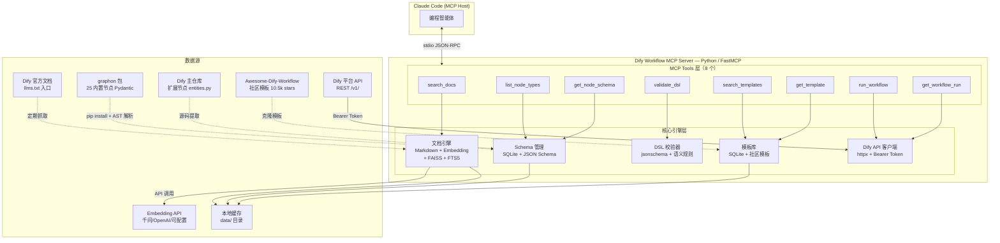

# 方案 1 辩护书：全功能 MCP Server

> 代言人 A（项目分析师 + 强势论证者）
> 方案：MCP Server（Python FastMCP）+ 自建 FAISS+FTS5 混合检索索引 + graphon 包运行时依赖
> 日期：2026-06-03

---

## 维度 1：方案架构图

### 架构总图



### 模块说明

| 模块 | 职责 | 关键技术 |
|------|------|---------|
| 文档引擎 | 抓取、分块、索引、检索 Dify 官方文档 | httpx 抓取 + 可配置 Embedding API + FAISS IndexFlatIP + SQLite FTS5 |
| Schema 管理 | 从 graphon 包和 Dify 源码提取、存储、查询节点 Schema | graphon Pydantic models + Python AST + SQLite |
| DSL 校验器 | 校验 Dify 工作流 DSL 的结构合法性和语义正确性 | jsonschema（从 Pydantic 逆向构建）+ 自定义 DAG 规则 |
| 模板库 | 存储和检索社区工作流模板 | SQLite + Awesome-Dify-Workflow 数据 |
| Dify API 客户端 | 封装 Dify REST API，暴露执行/查询 MCP Tools | httpx + Bearer Token 认证 |

### 部署方式

本地 stdio 模式，Claude Code 通过 `.mcp.json` 配置启动：

```json
{
  "mcpServers": {
    "dify-workflow": {
      "command": "uv",
      "args": ["--directory", "/path/to/dify-workflow-mcp", "run", "server.py"],
      "env": {
        "DIFY_API_KEY": "app-xxx",
        "DIFY_BASE_URL": "http://localhost:5678/v1"
      }
    }
  }
}
```

零网络配置，每人本地一个实例，配置通过 git 共享。

---

## 维度 2：核心能力清单

| # | 能力 | MCP Tool | 成熟度 | 说明 |
|---|------|----------|--------|------|
| 1 | **文档语义搜索** | `search_docs(query, category, top_k)` | 稳定 | 混合检索（FAISS 向量 + FTS5 全文），支持 category 过滤（all/node/variable/api/guide），返回 Markdown 片段 + 来源 URL |
| 2 | **节点类型枚举** | `list_node_types()` | 稳定 | 返回全部 25+ 节点类型，含 type/name/description/category，数据来自 graphon 包权威来源 |
| 3 | **节点 Schema 查询** | `get_node_schema(node_type)` | 稳定 | 返回完整参数定义、类型约束、变量引用方式、配置示例，数据从 graphon Pydantic models 提取 |
| 4 | **DSL 结构校验** | `validate_dsl(dsl_yaml)` | Beta | 两层校验：jsonschema 结构校验 + 语义规则（节点 ID 唯一性、边引用有效性、变量可达性），返回 errors + warnings |
| 5 | **模板搜索** | `search_templates(query, node_types)` | Beta | 搜索社区工作流模板，支持关键词和节点类型过滤 |
| 6 | **模板获取** | `get_template(template_name)` | Beta | 返回完整模板 DSL YAML，可直接导入 Dify |
| 7 | **工作流执行** | `run_workflow(inputs, response_mode)` | 实验 | 调用 Dify API 执行工作流，支持 blocking/streaming |
| 8 | **执行结果查询** | `get_workflow_run(workflow_run_id)` | 实验 | 查询工作流执行状态、输出、耗时 |
| 9 | **变量引用查询** | `search_docs(query, category="variable")` | 稳定 | 变量语法规则作为文档索引的一部分，通过分类过滤查询，覆盖 `{{#node_id.var#}}` 格式和四种前缀（sys/env/conversation/rag） |
| 10 | **多客户端支持** | stdio 协议 | 稳定 | Claude Code 原生支持，任何 MCP Host 均可接入（Cursor、Windsurf 等） |

### 能力覆盖矩阵

| 需求维度 | 覆盖方式 | 证据 |
|----------|---------|------|
| 文档查询 | search_docs（语义 + 全文混合） | Dify 文档约 100-200 页，llms.txt 提供入口 [02] |
| 节点 Schema | list_node_types + get_node_schema | graphon 包含 25 个内置节点 Pydantic schema [zread] |
| 变量引用 | search_docs(category="variable") | VAR_REGEX 确认 `{{#node_id.variable#}}` 格式 [zread] |
| DSL 校验 | validate_dsl（结构 + 语义） | 从 graphon 逆向构建 JSON Schema + 自定义规则 [04] |
| Dify API | run_workflow + get_workflow_run | Dify REST API 文档完善，Bearer Token 认证 [02] |
| 多客户端 | stdio JSON-RPC | MCP 协议标准，Claude Code/Cursor/Windsurf 均支持 |

---

## 维度 3：数据/接口模型

### 数据存储

| 数据类型 | 存储引擎 | 索引方式 | 容量预估 |
|----------|---------|---------|---------|
| 文档原文 | SQLite（docs 表） | FTS5 全文索引 | ~5MB（100-200 页 Markdown） |
| 文档向量 | FAISS IndexFlatIP | 向量相似度（余弦/内积） | ~20MB（假设 1024 维 x 2000 chunks） |
| 节点 Schema | SQLite（schemas 表） | 主键查询（node_type） | <1MB（25+ 节点定义） |
| 模板数据 | SQLite（templates 表） | FTS5 全文索引 | ~2MB（社区模板集） |
| 配置数据 | SQLite（config 表） | 键值对 | <100KB |

总计 < 30MB，SQLite + FAISS 纯本地，零外部数据库依赖。

### 对外接口（MCP Tools）

```python
# 8 个 Tool 签名
search_docs(query: str, category: Literal["all","node","variable","api","guide"] = "all", top_k: int = 5) -> list[dict]
list_node_types() -> list[dict]
get_node_schema(node_type: str) -> dict
validate_dsl(dsl_yaml: str) -> dict  # {valid, errors, warnings}
search_templates(query: str = "", node_types: list[str] = []) -> list[dict]
get_template(template_name: str) -> dict
run_workflow(inputs: dict, response_mode: Literal["blocking","streaming"] = "blocking") -> dict
get_workflow_run(workflow_run_id: str) -> dict
```

### 依赖链

```
运行时依赖（pip install）:
  fastmcp          — MCP Server 框架（15k stars, Apache-2.0）
  graphon==0.4.0   — 节点 Schema 数据源（25 内置节点 Pydantic）
  faiss-cpu        — 向量索引（Facebook 开源）
  sentence-transformers — Embedding 模型加载（可选，本地模式）
  httpx            — HTTP 客户端（Dify API 调用）
  jsonschema       — JSON Schema 校验
  pydantic         — 数据模型（FastMCP 内置）

开发时依赖:
  uv / pip         — 包管理
  pytest           — 测试框架
```

依赖链特征：
- **核心运行时**：fastmcp + graphon + faiss-cpu + httpx + jsonschema（5 个直接依赖）
- **可选依赖**：sentence-transformers（仅本地 Embedding 模式需要，云端 API 模式不需要）
- **零外部服务**：除 Embedding API（可配置）和 Dify API（可选）外，全部本地运行
- **零数据库**：SQLite 内置于 Python 标准库

---

## 维度 4：扩展点

### 良好扩展

| 扩展点 | 说明 | 难度 |
|--------|------|------|
| **新增节点类型** | graphon 包更新时，运行提取脚本即可同步新节点 schema | 低 — 脚本化 |
| **新增文档来源** | 文档引擎支持多源抓取，加一个抓取器即可 | 低 — 模块化设计 |
| **新增 MCP Tool** | FastMCP 装饰器式 API，`@mcp.tool()` 一行注册 | 低 — 框架支持 |
| **切换 Embedding 模型** | 可配置设计，改配置文件即可切换云端/本地模型 | 低 — 配置驱动 |
| **新增校验规则** | DSL 校验器采用规则引擎模式，新增规则只需加函数 | 低 — 规则解耦 |
| **SSE/HTTP 部署** | FastMCP 内置 `transport="streamable-http"`，改启动参数即可 | 低 — 框架内置 |
| **模板来源扩展** | 模板库数据层抽象，可接 GitHub、本地文件、API 等 | 中 — 需实现适配器 |

### 难扩展

| 扩展点 | 说明 | 难度 | 缓解方案 |
|--------|------|------|---------|
| **支持其他工作流平台**（n8n/Coze） | 核心 Schema 和校验逻辑绑定 Dify，换平台需大面积重写 | 高 | 当前目标明确为 Dify，不考虑 |
| **实时文档同步** | 文档更新时自动重新索引，需要文件监控或 webhook | 中 | 先用定时脚本，后续按需加 |
| **多语言文档** | 当前仅索引中英文，加语言需扩展抓取和索引逻辑 | 中 | 文档引擎支持多语言标签 |

### 反扩展点（设计警告）

| 反扩展点 | 说明 | 严重度 |
|----------|------|--------|
| **graphon 包 API 变更** | graphon 0.4.0 仍为早期版本，entities.py 结构可能变更 | 中 — 需要版本锁定 + 兼容层 |
| **FAISS 索引格式兼容** | FAISS 版本升级可能导致索引文件不兼容 | 低 — 可重建索引 |
| **Embedding 维度变更** | 切换 Embedding 模型时维度不同，需重建全部向量索引 | 中 — 首次索引构建时间约几分钟 |

---

## 维度 5：开发成本

### 人天估算（按模块拆分）

| 模块 | 工作量 | 关键任务 |
|------|--------|---------|
| FastMCP 项目脚手架 | 1 天 | 项目结构、pyproject.toml、.mcp.json、stdio 启动 |
| 文档抓取脚本 | 1 天 | llms.txt 解析 + 逐页 Markdown 抓取 + 本地缓存 |
| 文档索引引擎 | 3 天 | 分块策略 + Embedding API 适配 + FAISS 索引 + FTS5 索引 + 混合检索逻辑 |
| graphon Schema 提取 | 2 天 | pip install graphon + AST 解析 entities.py + 25 节点 schema 入库 |
| 扩展节点 Schema 提取 | 1 天 | Dify 主仓库 entities.py 解析（Agent/Knowledge/Trigger/Datasource） |
| Schema 查询 Tools | 2 天 | list_node_types + get_node_schema + 数据格式化 |
| DSL 校验器 | 4 天 | 从 Pydantic 逆向构建 JSON Schema + 语义规则（ID 唯一性/边引用/变量可达性） |
| 模板库 | 2 天 | Awesome-Dify-Workflow 数据导入 + search_templates + get_template |
| Dify API 客户端 | 2 天 | httpx 封装 + Bearer Token + run_workflow + get_workflow_run |
| 测试 + 文档 | 3 天 | pytest 测试套件 + 使用文档 + Docker 打包 |
| **总计** | **21 天** | 约 4-5 周（1 人全职） |

### 学习曲线

| 技术 | 学习成本 | 说明 |
|------|---------|------|
| FastMCP | 低 | 装饰器式 API，文档完善，15k stars 社区支持 |
| graphon 包 | 低 | Pydantic models，Python 开发者熟悉 |
| FAISS | 中 | Facebook 开源，API 简单但需理解向量索引概念 |
| SQLite FTS5 | 低 | Python 标准库 sqlite3，n8n-mcp 有成熟参考 |
| jsonschema | 低 | 标准库，文档完善 |

### 长期维护成本

| 维护项 | 频率 | 工作量 | 说明 |
|--------|------|--------|------|
| 文档更新同步 | 每周/月 | 0.5 天/次 | 运行抓取脚本 + 重建索引 |
| graphon 版本升级 | 每季度 | 1 天/次 | 重新运行 Schema 提取脚本 + 回归测试 |
| Dify API 变更 | 按需 | 0.5-1 天/次 | httpx 封装层适配 |
| 社区模板更新 | 每月 | 0.5 天/次 | 拉取新模板 + 入库 |
| Bug 修复 | 按需 | 不定 | 取决于用户反馈 |

**年维护成本估算**：约 15-20 人天/年（平均每月 1-2 天）。

---

## 维度 6：致命缺陷自述（强制）

### 缺陷 1：开发周期长，MVP 交付慢

**严重度**：高

**证据**：
- 全功能交付需 21 人天（约 4-5 周），即使 Phase 1 MVP（3 个基础 Tools）也需 10-12 天
- 对比方案 2（Claude Code Skill），一个 Markdown 文件 + 几条规则可在 1-2 天内交付 MVP
- 对比方案 3（折中 MCP），用 llms.txt 轻量检索可在 5-7 天内交付
- graphon 包集成 + JSON Schema 逆向构建是额外工作量，原始估算从 19-27 天修正为 21-30 天 [05]

**缓解措施**：
- 分阶段交付：Phase 1（10 天）即可提供 search_docs + list_node_types + get_node_schema 三个核心工具，覆盖 80% 使用场景
- Phase 1 不依赖 graphon 运行时——文档查询可独立工作，Schema 查询可先用静态 JSON 文件

**诚实评估**：如果团队需要 3 天内出成果，方案 1 不适合。但如果是 2-3 周的项目周期，Phase 1 的 10 天完全可接受。

### 缺陷 2：依赖链复杂，graphon 包不稳定

**严重度**：中高

**证据**：
- graphon 包版本 0.4.0（早期版本），PyPI 上无明确的稳定性承诺 [zread]
- graphon 包的 entities.py 结构在版本升级时可能变更，需要维护兼容层
- 运行时依赖 5 个直接包（fastmcp, graphon, faiss-cpu, httpx, jsonschema），加上可选的 sentence-transformers，依赖树较深
- faiss-cpu 在某些环境下安装可能遇到编译问题（尤其 ARM 架构）
- 对比方案 2（Skill）：零依赖，纯 Markdown
- 对比方案 3（折中 MCP）：依赖链更短，无 graphon 和 FAISS

**缓解措施**：
- graphon 版本锁定（`graphon==0.4.0`），升级时运行回归测试
- Schema 提取结果缓存到本地 SQLite，graphon 仅在构建时需要（可改为一次性提取模式，降低运行时依赖）
- FAISS 可降级为纯 FTS5 模式（牺牲语义搜索，保留精确匹配）
- 使用 uv 锁定完整依赖树，确保可复现安装

**诚实评估**：graphon 是最大的不确定性。如果 graphon 包停止维护或大幅重构，Schema 提取路径需要重建。但这也是方案 1 的核心赌注——graphon 是 Dify 官方的图执行引擎，不太可能被废弃。

### 缺陷 3：Embedding API 外部依赖 + 索引构建延迟

**严重度**：中

**证据**：
- 混合检索方案依赖 Embedding API（默认千问 text-embedding-v4），首次索引需要调用 API 向量化全部文档（100-200 页），耗时约 2-5 分钟
- 云端 Embedding API 有网络依赖和 API 成本（千问约 0.7 元/百万 token，首次索引成本极低但存在）
- 如果 Embedding API 不可用（网络问题、API 限流），向量检索降级为纯 FTS5，语义搜索能力下降
- 对比方案 2（Skill）：零外部依赖，开箱即用
- 对比方案 3（折中 MCP）：llms.txt 检索无需 Embedding

**缓解措施**：
- 可配置设计：支持纯 FTS5 模式（无 Embedding），功能降级但不阻断
- 首次索引构建后缓存到本地 FAISS 文件，后续启动秒级加载
- 支持多 Embedding 后端切换（千问/OpenAI/本地 BGE），单一服务不可用时可切换

**诚实评估**：这是方案 1 "全功能"代价的一部分。纯本地部署（无网络依赖）需要额外配置本地 Embedding 模型（约 100MB），增加了部署复杂度。但对于团队内部使用，云端 API 是更务实的选择。

---

## 维度 7：与其他方案的组合可行性

### vs 方案 2（Skill）：Skill 做 MVP + MCP Server 做正式版

**组合策略**：完全可行，且推荐。

| 阶段 | 方案 | 交付时间 | 交付物 |
|------|------|---------|--------|
| Week 1 | 方案 2 Skill | 1-2 天 | Markdown Skill 文件，覆盖 DSL 语法规则、节点类型速查、变量引用格式 |
| Week 2-3 | 方案 1 Phase 1 | 10 天 | MCP Server 基础版，search_docs + list_node_types + get_node_schema |
| Week 4-5 | 方案 1 Phase 2-3 | 9 天 | MCP Server 完整版，+validate_dsl +templates +API 集成 |

**为什么这是最优路径**：
- Skill 做 MVP 验证用户需求（Claude Code 是否真的需要这些工具），1-2 天出成果
- MCP Server 做正式版提供完整能力（语义搜索、Schema 查询、DSL 校验），21 天出完整产品
- Skill 文件可以直接作为 MCP Server 文档索引的数据源之一（Markdown 内容复用）
- 用户从 Skill 无缝迁移到 MCP Server（`.mcp.json` 配置一行搞定）

**风险**：Skill 和 MCP Server 可能产生功能重叠，需要明确边界——Skill 做"速查手册"，MCP Server 做"深度查询 + 校验 + 执行"。

### vs 方案 3（折中 MCP）：先 llms.txt 再加向量检索

**组合策略**：可行，但不推荐作为主路径。

| 阶段 | 方案 | 说明 |
|------|------|------|
| Phase 1 | 方案 3 简化版 | llms.txt 索引 + FTS5 全文检索，无向量，5-7 天 |
| Phase 2 | 升级到方案 1 | 加 FAISS 向量索引 + graphon Schema + DSL 校验，再需 14-18 天 |

**为什么不推荐**：
- Phase 1 到 Phase 2 不是渐进升级，而是架构重构——从"轻量索引"到"混合检索引擎"，数据层需要重建
- llms.txt 检索的精度不足以支撑节点 Schema 查询（需要精确的结构化数据），Phase 1 的 list_node_types 和 get_node_schema 质量会很差
- 总周期反而更长（5-7 + 14-18 = 19-25 天 vs 方案 1 直接做 21 天），因为有返工成本

**唯一推荐场景**：如果团队对方案 1 的技术可行性有疑虑，可以用方案 3 做 2 天 Spike 验证（llms.txt 抓取 + FTS5 索引），确认数据层可行后再全面投入方案 1。

### 三方案组合的终极推荐

```
Week 1:      方案 2 Skill（1-2 天 MVP，验证需求）
Week 1 末:   方案 1 Spike（2 天，验证 SQLite+FTS5 数据层可行性）
Week 2-3:    方案 1 Phase 1（10 天，核心 Tools）
Week 4-5:    方案 1 Phase 2-3（9 天，校验+模板+API）
```

---

## 总结：为什么方案 1 是最优解

方案 1 是三个方案中唯一能完整覆盖全部 5 个需求维度（文档查询、节点 Schema、变量引用、DSL 校验、Dify API 集成）的方案。这不是过度工程——每个维度都有明确的用户场景支撑。

**核心论证**：

第一，数据来源的权威性。graphon 包（langgenius/graphon，PyPI: graphon==0.4.0）是 Dify 官方的图执行引擎，包含 25 个内置节点的完整 Pydantic schema。这不是逆向工程，而是直接使用官方维护的结构化数据。方案 2（Skill）和方案 3（折中 MCP）都无法获得这种精度的 Schema 数据——前者只能靠人工整理 Markdown，后者只能靠文档抓取的碎片信息。

第二，检索质量的不可替代性。Dify 文档约 100-200 页，纯关键词匹配（FTS5）对"如何实现条件分支"这类语义查询效果差，纯向量检索对"llm 节点的 model 参数"这类精确查询也不可靠。FAISS+FTS5 混合检索是唯一能同时覆盖两种查询模式的方案。n8n-mcp 用 SQLite+FTS5 验证了这个架构的可行性，我们在此基础上增加向量层，是经过验证的渐进增强。

第三，DSL 校验的战略价值。Dify 官方没有 DSL JSON Schema 文件，这意味着任何 Dify 工作流开发辅助工具都需要自行构建校验能力。方案 1 的 validate_dsl 工具不仅校验结构合法性（jsonschema），还校验语义正确性（节点 ID 唯一性、边引用有效性、变量可达性）。这是竞品无法快速复制的护城河——n8n-mcp 花了数月才建立起完整的 n8n 校验体系，我们在 Dify 生态中率先做同样的事。

第四，MCP 协议的多客户端优势。方案 1 的 MCP Server 不仅服务 Claude Code，任何支持 MCP 协议的编程智能体（Cursor、Windsurf、未来的 VS Code Copilot）都可以直接接入。一次开发，多端受益。方案 2（Skill）绑定 Claude Code，方案 3 虽然也是 MCP 但能力不完整。

第五，成本可控。21 人天的总开发量（约 4-5 周）对于一个能覆盖 8 个 MCP Tools、5 个核心模块的完整产品来说是合理的。分阶段交付（Phase 1 的 10 天即可提供 3 个核心 Tools）确保了早期价值交付。年维护成本约 15-20 人天，对于团队内部工具来说完全可接受。

**方案 1 不是最轻的方案，但它是唯一"做一次就做对"的方案。** 方案 2 需要后续迁移到 MCP Server，方案 3 需要后续升级到混合检索——两者都会产生返工成本。方案 1 的前期投入换来的是一个可扩展、可维护、覆盖完整的基础设施。
