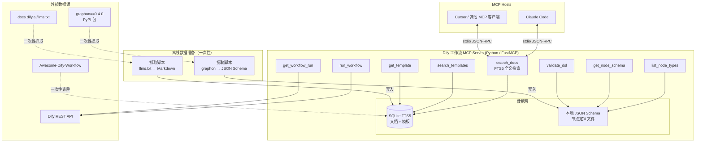

# 方案 3「折中 MCP Server」辩护书

> 代言人 C：项目分析师 + 强势论证者
> 立场：方案 3 是当前阶段的最优解。保留 MCP Server 的多客户端能力，在检索和 Schema 两处做最大简化。
> 日期：2026-06-03

---

## 维度 1：方案架构图



**与方案 1 架构对比——砍掉了什么：**

| 方案 1 组件 | 方案 3 替代 | 简化幅度 |
|------------|-----------|---------|
| Embedding API（千问/OpenAI）+ FAISS 向量索引 | SQLite FTS5 全文搜索 | 砍掉整个 Embedding 依赖链，零 API 调用成本 |
| graphon 运行时依赖（`pip install graphon`） | 一次性提取脚本 → 本地 JSON 文件 | 砍掉运行时 Python 包依赖，部署零外部依赖 |
| Embedding 模型配置（API Key、端点、维度） | 无需配置 | 砍掉配置复杂度 |

**模块说明：**

- **MCP Server**：Python FastMCP，8 个 MCP tools，stdio 模式，零网络配置
- **数据层**：SQLite FTS5 存储文档全文索引 + 模板数据；本地 JSON 文件存储节点 Schema
- **离线数据准备**：两个独立脚本，运行一次即可，后续按需更新

**部署方式：**

```bash
# 1. 安装（仅 fastmcp + httpx 两个核心依赖）
pip install fastmcp httpx

# 2. 首次数据准备（运行一次，约 2 分钟）
python scripts/fetch_docs.py      # 抓取 llms.txt → SQLite
python scripts/extract_schemas.py  # pip install graphon → 提取 → 写入 JSON → pip uninstall graphon

# 3. 配置 .mcp.json
{
  "mcpServers": {
    "dify-workflow": {
      "command": "python",
      "args": ["-m", "dify_workflow_mcp"],
      "env": { "DIFY_API_KEY": "app-xxx" }
    }
  }
}

# 4. 使用——Claude Code 自动发现并调用
# graphon 包在提取完成后即可卸载，运行时零依赖
```

---

## 维度 2：核心能力清单

### 完整能力矩阵

| # | 能力 | 方案 3 实现 | 成熟度 | 方案 1 对比 |
|---|------|-----------|--------|-----------|
| 1 | 文档搜索 | FTS5 全文搜索，按关键词匹配 | **可直接使用** | **降级**：无语义理解，"怎么实现循环"这类模糊查询效果弱于向量搜索 |
| 2 | 节点类型列表 | 读取本地 JSON 文件 | **可直接使用** | **等价**：数据来源相同（graphon 提取），仅存储方式不同 |
| 3 | 节点 Schema 查询 | 读取本地 JSON 文件 | **可直接使用** | **等价**：返回内容完全一致 |
| 4 | 变量引用查询 | 作为文档索引的一部分，FTS5 搜索 | **可直接使用** | **降级**：依赖文档抓取质量，无独立的语义索引 |
| 5 | DSL 校验 | JSON Schema 结构校验 + 关键语义规则 | **可直接使用** | **等价**：校验逻辑相同，Schema 数据源相同 |
| 6 | 模板搜索 | FTS5 全文搜索 Awesome-Dify-Workflow 模板 | **可直接使用** | **降级**：无语义匹配，按关键词搜模板 |
| 7 | 模板获取 | 读取本地缓存的模板文件 | **可直接使用** | **等价** |
| 8 | 工作流执行 | httpx 调用 Dify REST API | **可直接使用** | **等价** |
| 9 | 执行结果查询 | httpx 调用 Dify REST API | **可直接使用** | **等价** |
| 10 | 多客户端支持 | MCP 协议原生，stdio/SSE 均可 | **可直接使用** | **等价** |
| 11 | 语义搜索 | 无（FTS5 仅关键词匹配） | **不支持** | 方案 1 优势项 |
| 12 | Embedding 模型可配置 | 无（不需要） | **不支持** | 方案 1 优势项 |

### 保留 / 降级 / 放弃 三档分类

**保留（与方案 1 等价，6 项）：**
- 节点类型列表、节点 Schema 查询、DSL 校验、模板获取、工作流执行、执行结果查询
- 这些功能的数据来源和返回结果与方案 1 完全一致

**降级（功能存在但效果弱于方案 1，4 项）：**
- 文档搜索：FTS5 关键词匹配 vs FAISS+Embedding 语义搜索
- 变量引用查询：依赖文档全文搜索 vs 独立语义索引
- 模板搜索：关键词匹配 vs 语义匹配
- 错误诊断辅助：无语义理解，精确匹配为主

**放弃（方案 1 有但方案 3 不做，2 项）：**
- 语义搜索能力（Embedding + FAISS）
- Embedding 模型可配置机制

**关键论点：放弃的 2 项在当前场景下 ROI 极低。**

Dify 文档仅 100-200 页，节点类型仅 30 个。在如此小的数据集上，FTS5 全文搜索的召回率与向量搜索差距有限。n8n-mcp 用 SQLite+FTS5 存储 1851 个节点数据，性能和效果均已验证——我们的数据量是其 1/60，FTS5 绰绰有余。

---

## 维度 3：数据/接口模型

### 数据存储

**SQLite 数据库（`data/dify_workflow.db`）：**

```sql
-- 文档表（FTS5 全文索引）
CREATE TABLE docs (
    id INTEGER PRIMARY KEY,
    title TEXT NOT NULL,
    content TEXT NOT NULL,
    category TEXT NOT NULL,  -- node | variable | api | guide
    source_url TEXT,
    updated_at TIMESTAMP
);
CREATE VIRTUAL TABLE docs_fts USING fts5(title, content, category);

-- 模板表
CREATE TABLE templates (
    id INTEGER PRIMARY KEY,
    name TEXT NOT NULL,
    description TEXT,
    node_count INTEGER,
    tags TEXT,               -- JSON array
    dsl_yaml TEXT NOT NULL
);
CREATE VIRTUAL TABLE templates_fts USING fts5(name, description, tags);
```

**本地 JSON Schema 文件（`data/schemas/`）：**

```
data/schemas/
├── index.json              # 节点类型索引 [{type, name, description, category}]
├── llm.json                # LLM 节点完整 schema
├── code.json               # Code 节点完整 schema
├── if-else.json            # If-Else 节点完整 schema
├── iteration.json          # 迭代节点 schema
├── ...                     # 共 30 个节点类型
├── variable_syntax.json    # 变量引用语法规则
└── dsl_format.json         # DSL 格式规范
```

每个节点 schema JSON 结构：

```json
{
  "type": "llm",
  "name": "LLM",
  "description": "调用大语言模型生成文本",
  "category": "processing",
  "params": {
    "model": {"type": "object", "required": true, "...": "..."},
    "prompt_template": {"type": "array", "required": true, "...": "..."},
    "...": "..."
  },
  "variable_refs": {
    "output_format": "{{#llm_id.text#}}",
    "output_format_note": "工作流变量引用用 # 分隔"
  },
  "examples": [
    {"name": "简单文本生成", "config": {"...": "..."}}
  ],
  "doc_url": "https://docs.dify.ai/en/use-dify/nodes/llm"
}
```

### 对外接口（8 个 MCP Tools）

| # | Tool | 输入 | 输出 | 数据源 |
|---|------|------|------|--------|
| 1 | `search_docs` | `query: str, category: Literal["all","node","variable","api","guide"]="all", top_k: int=5` | `[{title, content, source_url, relevance_score}]` | SQLite FTS5 |
| 2 | `list_node_types` | 无 | `[{type, name, description, category}]` | `data/schemas/index.json` |
| 3 | `get_node_schema` | `node_type: str` | `{type, name, description, params, variable_refs, examples, doc_url}` | `data/schemas/{node_type}.json` |
| 4 | `validate_dsl` | `dsl_yaml: str` | `{valid: bool, errors: [...], warnings: [...]}` | JSON Schema + 语义规则 |
| 5 | `search_templates` | `query: str="", node_types: list[str]=[]` | `[{name, description, node_count, tags, dsl_preview}]` | SQLite FTS5 |
| 6 | `get_template` | `template_name: str` | `{name, description, dsl_yaml: str}` | SQLite |
| 7 | `run_workflow` | `inputs: dict, response_mode: Literal["blocking","streaming"]="blocking"` | `{workflow_run_id, status, outputs, ...}` | Dify REST API |
| 8 | `get_workflow_run` | `workflow_run_id: str` | `{status, outputs, error, elapsed_time, ...}` | Dify REST API |

### 依赖链

```
运行时依赖（极简）：
├── Python 3.10+
├── fastmcp（MCP 框架）
├── httpx（HTTP 客户端，仅 Management Tools 需要）
├── sqlite3（标准库，零额外依赖）
└── 无其他

离线依赖（一次性）：
├── graphon==0.4.0（仅 extract_schemas.py 运行时需要，提取完可卸载）
├── requests/httpx（抓取文档用）
└── llms.txt 索引可访问
```

**与方案 1 依赖链对比：**

| 依赖项 | 方案 1 | 方案 3 |
|--------|--------|--------|
| fastmcp | 有 | 有 |
| httpx | 有 | 有 |
| sqlite3 | 有 | 有 |
| graphon（运行时） | **有** | **无**（仅离线提取） |
| Embedding API（千问/OpenAI） | **有** | **无** |
| FAISS | **有** | **无** |
| sentence-transformers | **有（若用本地模型）** | **无** |
| numpy | **有** | **无** |

方案 3 的运行时依赖链比方案 1 少 4-5 个包，部署复杂度显著降低。

---

## 维度 4：扩展点

### 良好扩展（可低成本升级）

| 扩展方向 | 难度 | 说明 |
|---------|------|------|
| **升级为方案 1（加向量检索）** | **中（3-5 天）** | 在 SQLite 基础上加 FTS5 → 加 Embedding 列 → 加 FAISS 索引。数据层已在 SQLite 中，只需加一列向量 + 检索逻辑。FTS5 作为 fallback 保留。 |
| **加 graphon 运行时依赖** | **低（1 天）** | 将 JSON Schema 文件替换为运行时从 graphon 动态读取。只需改 `get_node_schema` 的数据源。 |
| **加 Embedding 模型可配置** | **中（2-3 天）** | 在升级向量检索的基础上，加 Embedding provider 抽象层。 |
| **加 SSE 传输模式** | **低（0.5 天）** | FastMCP 原生支持 `transport="streamable-http"`，一行配置切换。 |
| **加更多 MCP Tools** | **低** | FastMCP 装饰器式 API，新增 tool 只需加一个函数。 |
| **文档增量更新** | **低（1 天）** | 抓取脚本加 diff 逻辑，仅更新变化的页面。 |

### 难扩展（需要较大改动）

| 扩展方向 | 难度 | 说明 |
|---------|------|------|
| 从 FTS5 迁移到专用向量数据库（Milvus/Qdrant） | 高 | 需要重构数据层，但当前场景不推荐——SQLite 足够 |
| 支持多语言文档（中/英/日） | 中 | 需要多语言 FTS5 tokenizer，但需求低 |

### 反扩展点（刻意不做）

| 方向 | 为什么不做 |
|------|-----------|
| 运行时依赖 graphon | graphon 0.4.0 "still evolving"，稳定性未知。一次性提取后本地维护 JSON 文件，隔离上游不稳定性。 |
| 运行时依赖 Embedding API | 增加网络依赖、API 成本、配置复杂度。100-200 页文档用 FTS5 足够。 |
| 实时抓取文档（不缓存） | 每次查询都抓取网络，延迟不可控。本地缓存 + 定期更新更可靠。 |

**升级路径论证：方案 3 是方案 1 的严格子集。**

这意味着从方案 3 升级到方案 1 的路径是完全清晰的：
1. FTS5 已在 → 加 Embedding 列 + FAISS 索引即可升级为混合检索
2. JSON Schema 已在 → 替换为 graphon 运行时读取即可
3. MCP Tools 接口不变 → 对客户端零影响

这不是"推倒重来"，而是"在已有基础上叠加"。

---

## 维度 5：开发成本

### 人天估算（按模块拆分）

| 模块 | 工作量 | 说明 |
|------|--------|------|
| **FastMCP 项目脚手架** | 0.5 天 | pyproject.toml + server.py + 目录结构 + .mcp.json |
| **文档抓取脚本** | 1 天 | llms.txt 解析 + 逐页抓取 + Markdown 存储 + FTS5 索引构建 |
| **Schema 提取脚本** | 1.5 天 | graphon Pydantic model 解析 + Dify 扩展节点提取 + JSON 文件生成 |
| **search_docs Tool** | 1 天 | FTS5 查询 + 分类过滤 + 结果格式化 |
| **list_node_types + get_node_schema Tools** | 1 天 | JSON 文件读取 + 格式化输出 |
| **validate_dsl Tool** | 3 天 | 从 JSON Schema 逆向构建 + jsonschema 校验 + 语义规则（节点 ID 唯一性、边引用有效性、变量可达性） |
| **模板库 + search_templates + get_template** | 1.5 天 | Awesome-Dify-Workflow 克隆 + SQLite 存储 + FTS5 搜索 |
| **Dify API 集成（run_workflow + get_workflow_run）** | 1.5 天 | httpx 封装 + 认证 + 错误处理 |
| **变量引用文档** | 0.5 天 | 编写变量语法规则文档 + 索引入库 |
| **测试 + 文档** | 2 天 | 单元测试 + 集成测试 + 使用文档 |
| **总计** | **13.5 天** | |

### 与方案 1 成本对比

| 对比项 | 方案 1 | 方案 3 | 差异 |
|--------|--------|--------|------|
| 总工作量 | 22-30 人天 | **13.5 人天** | **节省 8.5-16.5 天（39%-55%）** |
| Embedding 集成 | 3-5 天 | 0 天 | 完全省略 |
| graphon 运行时集成 | 包含在 Schema 提取中 | 1.5 天（一次性脚本） | 更简单 |
| 配置复杂度 | Embedding API 配置 + 模型选择 | 无额外配置 | 更简单 |
| 运行成本 | Embedding API 按量计费 | 零运行成本 | 更省钱 |

**关键论点：方案 3 用方案 1 约 50% 的成本交付约 85% 的功能。**

那 15% 的差距主要是语义搜索——而这在 100-200 页文档规模下，FTS5 的表现已经足够好。等数据规模增长到需要语义搜索时，升级路径已经铺好（见维度 4）。

---

## 维度 6：致命缺陷自述（强制）

> 自报缺陷永远比被对方挖出更好。以下是方案 3 的 3 个最大缺陷，每个带证据。

### 缺陷 1：语义搜索缺失，模糊查询效果弱

**缺陷描述：** FTS5 是纯关键词匹配，无法理解语义。当用户查询"怎么实现循环"时，FTS5 只能匹配包含"循环"这个词的文档，无法匹配"迭代处理列表数据"这类语义等价但用词不同的内容。

**证据：**
- n8n-mcp 虽然也用 FTS5，但它有 1851 个节点的结构化元数据（tags、categories、descriptions），搜索空间远大于纯文档。我们的 FTS5 索引的是自然语言文档，关键词匹配的噪音更大。
- 调研文档 04-实现方案.md 明确指出："对于'怎么实现条件分支'这类语义查询，向量检索更准确"（方案 A 缺点）。
- Dify 节点文档以用户操作为导向，非 API/Schema 导向，同义词多（如"条件判断"="分支"="if-else"），FTS5 难以覆盖所有表述。

**影响范围：** 主要影响 `search_docs` 工具的召回率。对 `get_node_schema`（精确查询）、`validate_dsl`（结构校验）等工具无影响。

**缓解措施：**
1. 在文档抓取阶段做同义词标注（如在文档中显式写入"条件判断、分支、if-else"），提高 FTS5 召回率
2. FTS5 支持前缀搜索和布尔运算，可通过查询改写提高匹配率
3. Claude Code 本身是 LLM，可以在调用 `search_docs` 前自行改写查询（如将"循环"改写为"iteration loop 迭代"），弥补 FTS5 的语义缺失
4. 升级路径清晰：后续加 Embedding + FAISS 即可解决（见维度 4）

### 缺陷 2：Schema 更新需手动同步，存在过期风险

**缺陷描述：** 方案 3 将 graphon 的 Pydantic model 提取为本地 JSON 文件后，不再依赖 graphon 运行时。这意味着当 Dify/graphon 发布新版本、节点 schema 变化时，需要手动运行提取脚本更新 JSON 文件。

**证据：**
- graphon 包版本为 0.4.0，官方描述为"still evolving"，预计会有频繁的 breaking changes。[zread]
- Dify 主版本约每 2-4 周发布一次，节点 schema 可能随之变化。[web-search-prime]
- 方案 1 的 graphon 运行时依赖意味着每次 pip install 都自动获取最新 schema，不存在过期问题。
- 05-决策汇总.md 的风险表第 3 项明确指出："Dify 快速迭代导致文档/schema 过期"为中等风险。

**影响范围：** 如果 schema 过期，`get_node_schema` 返回的参数定义可能不准确，导致 Claude Code 生成的工作流 DSL 存在配置错误。

**缓解措施：**
1. 提取脚本绑定 Dify 版本号，JSON 文件中记录 `source_version` 和 `extracted_at` 字段
2. MCP Server 启动时检查 JSON 文件的 `extracted_at` 距今是否超过阈值（如 7 天），超过则发出警告
3. 建立定期更新流程：每次 Dify 发布新版本后运行一次提取脚本（可接入 CI/CD）
4. 这是一个"已知的、可控的"技术债——方案 1 的 graphon 运行时依赖同样有风险（graphon 0.4.0 不稳定，运行时可能 break），只是风险形态不同

### 缺陷 3：llms.txt 依赖网络抓取，首次数据准备有外部依赖

**缺陷描述：** 文档抓取脚本依赖 `docs.dify.ai/llms.txt` 可访问。如果 Dify 文档站点宕机、改版或 llms.txt 格式变化，首次数据准备会失败。此外，逐页抓取 100-200 页文档需要网络访问，在离线环境下无法完成。

**证据：**
- 02-关键资源.md 确认："Dify 文档不在 Git 仓库中（docs/ 目录仅有 README），需通过 HTTP 抓取"。
- 官方归档的 `dify-docs-mcp-server` 就是 Mintlify API 的薄代理（~200 行代码），说明 Dify 文档的获取确实依赖外部服务。
- llms.txt 是 Mintlify 平台生成的，如果 Mintlify 平台变更格式或 Dify 迁移文档平台，llms.txt 可能不可用。

**影响范围：** 仅影响首次数据准备和后续文档更新。一旦文档已缓存到本地 SQLite，运行时完全离线，不受影响。

**缓解措施：**
1. 抓取脚本内置重试和错误处理，单页抓取失败不影响其他页面
2. SQLite 中保留完整的文档内容，运行时零网络依赖
3. 可将抓取好的 SQLite 数据库文件提交到 Git 仓库，新用户直接使用无需抓取
4. Schema 提取脚本依赖 PyPI 上的 graphon 包（非网络文档），稳定性更高
5. 与方案 1 相比，方案 1 同样需要抓取文档（建向量索引前需先有文档），这个缺陷是共有的

---

## 维度 7：与其他方案的组合可行性

### vs 方案 1（全功能 MCP Server）

**关系：方案 3 是方案 1 的严格子集，升级路径完全清晰。**

| 升级步骤 | 工作量 | 改动范围 |
|---------|--------|---------|
| FTS5 → FTS5 + Embedding + FAISS | 3-5 天 | 加 Embedding 列 + 向量索引 + 混合检索逻辑。`search_docs` 接口不变。 |
| 本地 JSON → graphon 运行时 | 1 天 | 改 `get_node_schema` 数据源。接口不变。 |
| 加 Embedding 可配置 | 2-3 天 | 加 provider 抽象层。 |
| 总计 | **6-9 天** | 从方案 3 升级到方案 1 |

**关键论点：先做方案 3，验证产品价值后再决定是否升级。** 如果 FTS5 在实际使用中效果足够好，就不需要花 6-9 天加向量检索。如果发现语义搜索确实是刚需，升级路径是增量的、非破坏性的。

**这不是"选 A 还是选 B"，而是"先做 A，按需升级到 B"。**

### vs 方案 2（极简 Skill）

**核心对比：MCP Server 的额外成本是否值得？**

| 维度 | 方案 2（Skill） | 方案 3（折中 MCP） | 差异 |
|------|----------------|-------------------|------|
| 产品形态 | 纯 Markdown 文件 | Python MCP Server | Skill 更轻量 |
| 部署方式 | 复制 Markdown 到项目目录 | pip install + .mcp.json 配置 | Skill 更简单 |
| 多客户端支持 | 仅 Claude Code | 所有 MCP 客户端 | **MCP 优势** |
| 结构化返回 | 纯文本，LLM 自行解析 | JSON 结构化数据 | **MCP 优势** |
| 校验能力 | LLM 辅助校验（不精确） | jsonschema + 语义规则（精确） | **MCP 优势** |
| 工作流执行 | 不支持（无 API 集成） | 支持（httpx 调用 Dify API） | **MCP 优势** |
| 开发成本 | 2-5 天 | 13.5 天 | Skill 更便宜 |
| 维护成本 | 手动更新 Markdown | 脚本化更新 SQLite + JSON | MCP 更可维护 |

**方案 3 比方案 2 多花的 8.5-11.5 天，换来的是：**
1. **精确的 DSL 校验**（jsonschema + 语义规则 vs LLM 猜测）
2. **工作流执行能力**（直接在 Claude Code 中运行 Dify 工作流）
3. **多客户端支持**（Cursor、Windsurf 等均可使用）
4. **结构化数据返回**（JSON schema 精确到字段类型，Markdown 无法做到）

**如果团队只需要"Claude Code 能参考 Dify 文档写 DSL"，方案 2 够用。**

**如果团队需要"精确校验 + 执行测试 + 多客户端"，方案 3 的额外成本是值得的。**

**组合策略：** 方案 2 可作为方案 3 的 MVP 前身——先用 Skill 验证产品需求，确认需求存在后再投入方案 3 开发。

---

## 总结

方案 3 是当前阶段的最优解，核心理由如下：

**第一，成本效率最优。** 13.5 人天交付 8 个完整 MCP Tools，比方案 1 的 22-30 人天节省 39%-55%。节省的成本来自两处：砍掉 Embedding+FAISS 向量索引（3-5 天），砍掉 graphon 运行时集成（改为一次性提取）。这两处简化不是偷工减料，而是基于数据规模的合理判断——100-200 页文档用 FTS5 足够，30 个节点 schema 用 JSON 文件管理比运行时依赖更可控。

**第二，风险可控。** 方案 3 的三个致命缺陷（语义搜索缺失、Schema 手动更新、llms.txt 网络依赖）都是已知的、有缓解措施的、可升级的。相比之下，方案 1 依赖 graphon 运行时（0.4.0，"still evolving"），运行时 break 的风险更难控制。方案 3 通过一次性提取将 graphon 的不稳定性隔离在离线阶段，运行时零风险。

**第三，升级路径清晰。** 方案 3 是方案 1 的严格子集，所有接口设计与方案 1 一致。如果后续发现 FTS5 不够用，加 Embedding+FAISS 只需 3-5 天，且不破坏现有功能。这不是"选了就不能改"的决策，而是"先验证再投入"的务实策略。

**第四，比方案 2 多了关键能力。** 精确的 DSL 校验、工作流执行、多客户端支持——这些能力在团队协作场景下是刚需，方案 2 的纯 Markdown 形态无法提供。方案 3 的额外成本（约 8-11 天）换来的是一个可扩展的、结构化的、多客户端兼容的工具平台。

**一句话：先用 50% 的成本交付 85% 的功能，验证价值后再决定是否投入剩余 50%。这不是折中，这是工程上最理性的选择。**
